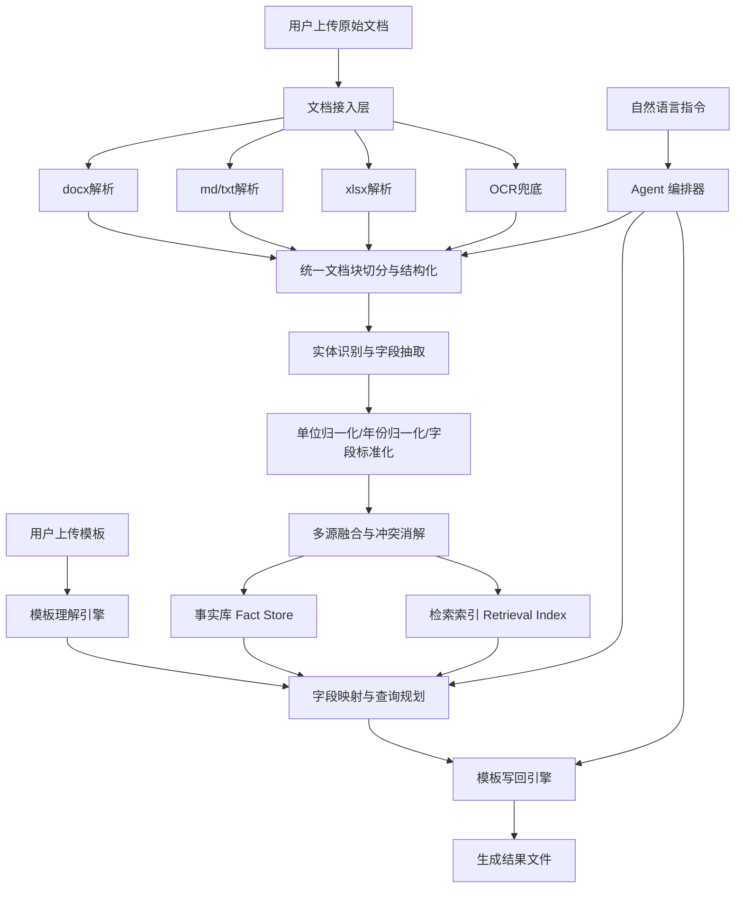

# A23 基于大语言模型的文档理解与多源数据融合系统——技术栈推荐与详细解决方案

## 0. 文档说明

本文面向第十七届中国大学生服务外包创新创业大赛 A23 赛题《基于大语言模型的文档理解与多源数据融合系统》，目标是给出一套**适合比赛落地、便于展示、兼顾准确率与响应时间**的完整方案。方案重点围绕赛题要求的三个关键模块展开：

1. 文档智能操作交互模块；
2. 非结构化文档信息提取模块；
3. 表格自定义数据填写模块。

同时，本文会特别针对比赛测评方式进行架构优化：**先一次性处理全部原始文档，再对 5 个模板表格进行快速自动填充**，从而在准确率与时延两个维度同时取得优势。

---

## 1. 赛题理解与需求拆解

### 1.1 赛题本质

这道题本质上不是一个“纯聊天机器人”题，而是一个**文档理解 + 信息抽取 + 多源融合 + 模板回填 + 可交互代理**的复合系统题。

它要求系统把分散在 docx、md、xlsx、txt 等多种文档中的半结构化/非结构化信息，转化为可检索、可追溯、可自动写回模板的数据资产。

### 1.2 真正的评分关键

从赛题描述看，最终评分并不只看“模型聪不聪明”，而是看：

- **填表准确率是否稳定高于 80%**；
- **单个模板文件的响应时间是否不超过 90 秒**；
- 当准确率差距不大时，**响应时间**会成为关键胜负手；
- 系统必须支持**异步调用**与**多类型文档稳定运行**；
- 需要包含三个明确的功能模块，而不是只做一个信息抽取 Demo。

### 1.3 比赛场景下的最重要策略

比赛流程是：

1. 先一次性上传一批测试文档；
2. 再逐个上传 5 个模板表格；
3. 系统每次根据已上传文档自动填写模板。

这意味着系统最优策略不是“每来一个模板就重新读所有文档”，而是：

- **阶段一：文档预处理与知识入库**
  - 文档分类
  - 文本抽取
  - 结构解析
  - 实体与字段抽取
  - 单位归一化
  - 多源融合
  - 建立索引

- **阶段二：模板快速理解与定向填充**
  - 识别模板表头/字段语义
  - 到结构化事实库中检索
  - 快速写回模板
  - 输出结果与追溯日志

也就是说，比赛版系统应该设计为一个**“先建库、再秒填”**的两阶段架构。

---

## 2. 推荐技术栈

## 2.1 总体原则

推荐采用“**规则约束 + 大模型理解 + 可追溯结构化存储**”的混合方案，而不是完全依赖大模型自由生成。

原因很简单：

- 比赛需要较高准确率；
- 数值字段、单位、年份、实体名非常容易出现“看似合理但错误”的生成；
- 模板填表是强结构化任务，更适合“LLM 负责理解，规则负责落地”；
- 文档类型固定（docx/md/xlsx/txt），完全可以做针对性优化，没必要一开始就上过于沉重的通用文档 AI 链路。

## 2.2 比赛版推荐技术栈（首选）

| 层级 | 推荐技术 | 作用 | 选择理由 |
|---|---|---|---|
| 前端 | React  + Element Plus | Web 管理台 | 开发快、组件成熟、演示效果好 |
| PC 封装 | Tauri（可选） | 打包桌面端 | 满足“桌面端/PC 软件”展示需求，体积小 |
| 后端 API | FastAPI | 提供 REST API / WebSocket | Python 生态友好，适合异步任务与 AI 服务编排 |
| 异步任务 | Celery + Redis | 文档解析、抽取、填表任务队列 | 满足赛题“支持异步调用”的要求 |
| 文档解析 | python-docx / openpyxl / pandas / markdown-it-py / 原生 txt 解析 | 定向解析 docx/xlsx/md/txt | 对赛题给定文件类型更快更稳 |
| OCR 兜底 | PaddleOCR（仅兜底启用） | 处理图片型片段、截图、扫描图 | 比赛输入主类型不是图片，但需要保留鲁棒性 |
| LLM 编排 | 自定义 Agent 或 LangGraph 风格流程 | 任务规划、字段理解、模板映射、自然语言指令解析 | 可解释、可控、便于演示 |
| 模型接口 | 兼容 OpenAI 风格 API 的大模型服务 | 结构化输出、函数调用、长上下文理解 | 便于切换云端/本地模型 |
| 向量/检索 | PostgreSQL + pgvector（比赛版首选） | 结构化事实、向量索引、JSONB 存储 | 服务数量少，易部署，适合 Demo |
| 文档对象存储 | MinIO | 原始文件、解析中间件、结果文件存储 | 方便管理上传/回填结果 |
| 模板写回 | openpyxl / python-docx | Excel/Word 模板回填且尽量保留格式 | 适配比赛模板场景 |
| 日志监控 | Loguru + Prometheus（可选） | 任务日志、耗时、成功率 | 便于答辩展示可观测性 |
| 部署 | Docker Compose | 一键部署 Demo | 适合比赛交付与录制视频 |

## 2.3 生产增强版可选扩展

如果你们希望把方案讲得更像企业级产品，可以增加以下组件：

| 增强方向 | 可选技术 | 适用场景 |
|---|---|---|
| 搜索增强 | Elasticsearch / OpenSearch | 大规模全文检索、关键词召回更强 |
| 图谱融合 | Neo4j | 需要展示实体关系图、跨文档关联推理 |
| 权限与审计 | Keycloak / Casbin | 多角色、多部门、多租户场景 |
| 在线协作 | OnlyOffice / 文档预览服务 | 文档在线预览、批注、人工校验 |
| 本地推理 | vLLM / Ollama / 自建推理服务 | 校内离线部署或成本控制 |

## 2.4 为什么不建议比赛版一开始就做得太重

不建议比赛版同时上：MongoDB + Elasticsearch + Neo4j + Milvus + 多模型微服务。

原因：

1. 对本科竞赛来说部署复杂度太高；
2. 视频演示、现场答辩更看重稳定性和可讲清楚；
3. 真正决定成绩的是**准确填表 + 响应速度 + 场景贴合度**；
4. 赛题输入格式并没有复杂到必须上全家桶。

因此，**比赛首版优先推荐**：

> React + FastAPI + Celery + Redis + PostgreSQL(pgvector) + MinIO + python-docx/openpyxl + LLM API

这套组合已经足以覆盖赛题要求，并且工程上容易成功。

---

## 3. 系统总体解决方案

## 3.1 系统定位

建议系统命名为：

**DocFusion Copilot（文档智融助手）**

系统定位：

> 面向校园与企业办公场景的“文档理解—知识入库—模板回填—自然语言交互”一体化智能系统。

## 3.2 核心目标

### 目标一：把文档读懂

支持对 docx、md、xlsx、txt 文档进行自动导入、类型识别、结构解析、字段抽取与语义理解。

### 目标二：把信息建库

把文档中的实体、指标、字段、时间、金额、数量等关键数据，转为统一结构的“事实记录（Fact）”，并保留来源与置信度。

### 目标三：把模板填好

根据用户上传的 Word/Excel 模板，自动识别要填什么、去哪里找、怎么写回，并尽量保持原有格式。

### 目标四：让用户用自然语言操作

支持用户通过自然语言下达指令，例如：

- “提取所有城市的 GDP、人口和财政收入并生成 Excel。”
- “把这份报告中的一级标题统一为黑体三号。”
- “把合同里的甲方、乙方、签订日期和金额提取入库。”
- “根据模板表格自动补齐所有空白字段。”

## 3.3 总体架构图



---

## 4. 数据模型设计

## 4.1 为什么必须做统一数据模型

如果系统只做“把一段文本丢给大模型然后吐一个答案”，那么：

- 无法追溯来源；
- 无法处理冲突；
- 无法稳定填模板；
- 无法支持后续多轮问答和数据库入库；
- 很难说服评委这是“多源数据融合系统”。

所以必须设计统一的数据模型。

## 4.2 核心对象

### 1）Document（文档）

```json
{
  "doc_id": "doc_001",
  "file_name": "2025中国城市经济报告.docx",
  "doc_type": "docx",
  "upload_time": "2026-03-25T10:00:00",
  "status": "parsed"
}
```

### 2）Block（文档块）

用于表示段落、表格行、标题、单元格区域等。

```json
{
  "block_id": "blk_001",
  "doc_id": "doc_001",
  "block_type": "paragraph",
  "section_path": ["一、双核领航", "新高度"],
  "text": "上海以56708.71亿元的GDP总量稳居全年第一...",
  "page_or_index": 12
}
```

### 3）Fact（事实记录）

这是整个系统最关键的数据结构。

```json
{
  "fact_id": "fact_001",
  "entity_type": "city",
  "entity_name": "上海",
  "field_name": "GDP总量",
  "value_num": 56708.71,
  "value_text": "56,708.71",
  "unit": "亿元",
  "year": 2025,
  "source_doc_id": "doc_001",
  "source_block_id": "blk_001",
  "confidence": 0.96,
  "status": "confirmed"
}
```

### 4）TemplateTask（模板任务）

```json
{
  "task_id": "tpl_001",
  "template_name": "城市指标汇总.xlsx",
  "target_schema": [
    "城市名",
    "GDP总量（亿元）",
    "常住人口（万）",
    "人均GDP（元）",
    "一般公共预算收入（亿元）"
  ],
  "status": "done"
}
```

## 4.3 建议的数据库表

### 结构化表

- `documents`
- `document_blocks`
- `facts`
- `fact_alias`
- `template_tasks`
- `template_cells`
- `fill_results`
- `review_logs`

### 关键字段建议

`facts` 表建议至少包含：

- `entity_type`
- `entity_name`
- `field_name`
- `field_alias`
- `value_num`
- `value_text`
- `unit`
- `year`
- `source_doc_id`
- `source_block_id`
- `source_span`
- `confidence`
- `conflict_group_id`
- `is_canonical`

这样才能支撑：

- 多来源融合；
- 冲突消解；
- 回填追溯；
- 人工审核；
- 后续问答。

---

## 5. 三大核心模块设计

## 5.1 模块一：文档智能操作交互模块

### 5.1.1 模块目标

把用户自然语言指令转成可执行的文档操作。

### 5.1.2 支持的能力

1. 文档内容提取
2. 标题/段落/表格格式调整
3. 关键信息定位
4. 自动摘要
5. 指定字段抽取
6. 结果导出为 Word / Excel / JSON
7. 模板填表调用

### 5.1.3 实现方式

采用“**大模型负责理解意图 + 工具函数负责真正执行**”的思路。

#### 指令示例

用户输入：

> “提取这批报告中所有城市的 GDP、常住人口、人均 GDP 和一般公共预算收入，并填写到模板中。”

Agent 输出结构化计划：

```json
{
  "intent": "extract_and_fill_template",
  "entities": ["城市"],
  "fields": ["GDP总量", "常住人口", "人均GDP", "一般公共预算收入"],
  "target": "uploaded_template",
  "need_db_store": true
}
```

然后调用：

- `parse_documents()`
- `extract_facts()`
- `normalize_units()`
- `fill_template()`

### 5.1.4 关键设计点

#### 1）指令解析器

将自然语言解析为：

- 意图（intent）
- 约束（constraint）
- 目标字段（fields）
- 输出格式（output_format）
- 是否入库（persist）

#### 2）工具注册中心

把文档操作封装为工具：

- `doc_extract`
- `doc_reformat`
- `template_fill`
- `db_save`
- `fact_query`
- `review_export`

#### 3）预览与撤销

为了提升答辩观感，建议加入：

- 预览变更结果
- 一键撤销上一步操作
- 显示被修改的单元格/段落

这会让系统看起来更像真实办公产品，而不是一次性脚本。

---

## 5.2 模块二：非结构化文档信息提取模块

### 5.2.1 模块目标

对用户导入的 docx、md、xlsx、txt 文档进行智能识别、字段抽取、标准化、存储。

### 5.2.2 推荐处理流程


### 5.2.3 为什么这里必须“分层抽取”

如果直接整篇文档让大模型输出所有字段，常见问题是：

- 漏字段；
- 错年份；
- 数字错位；
- 单位混淆；
- 表格和正文信息互相覆盖。

因此建议做成以下 4 层：

#### 第一层：结构解析

按文档类型定向解析：

- `docx`：标题、段落、表格、图片占位、批注位置
- `md`：标题层级、列表、代码块、表格
- `txt`：段落与分隔符
- `xlsx`：工作表、表头、区域、公式结果、合并单元格

#### 第二层：候选块召回

通过关键词、标题路径、实体词典、字段词典，找到疑似相关的 block。

#### 第三层：字段级抽取

让大模型只处理“相关块 + 指定字段”，输出 JSON，而不是自由生成长文本。

#### 第四层：规则校验与归一化

例如：

- `56,708.71 亿元` → `56708.71`
- `2,487.45 万人` → `2487.45`
- `22.8万元` 与 `228020元` 的统一换算
- 去掉千分位逗号
- 补齐年份上下文

### 5.2.4 抽取结果必须保留来源

每条事实必须记录：

- 来自哪个文档；
- 来自哪个段落或单元格；
- 原文片段是什么；
- 模型置信度多少；
- 是否经过规则校验；
- 是否被其他来源支持。

这对比赛非常重要，因为评委一旦追问“填错了怎么查来源”，你们必须能展示追溯链路。

---

## 5.3 模块三：表格自定义数据填写模块

### 5.3.1 模块目标

在用户上传模板后，系统自动理解模板结构，从事实库中查询对应值并回填。

### 5.3.2 模块核心难点

这部分是整道题最关键也最容易出问题的地方。难点不在“写 Excel”，而在“知道每个格子到底该填什么”。

### 5.3.3 解决思路：模板理解四步法

#### 第一步：识别模板语义结构

识别：

- 表头
- 副表头
- 合并单元格
- 行锚点
- 列锚点
- 空白区
- 备注区

#### 第二步：构建目标 Schema

比如用户示例图中的表格，系统需要识别出目标字段大致为：

- 城市名
- GDP总量（亿元）
- 常住人口（万）
- 人均GDP（元）
- 一般公共预算收入（亿元）

#### 第三步：生成查询计划

例如：

- 行实体 = 城市
- 列字段 = GDP总量 / 常住人口 / 人均GDP / 一般公共预算收入
- 单位 = 从表头读取
- 年份 = 默认取文档上下文最近的年份，优先 2025

#### 第四步：写回并校验

写回时进行：

- 样式继承
- 单位对齐
- 小数位统一
- 空值标记
- 低置信度高亮

### 5.3.4 推荐回填策略

#### 策略 A：优先填“强匹配字段”

对于以下字段优先采用规则+校验填充：

- 金额
- 人数
- 比例
- 日期
- 编号

#### 策略 B：对语义字段使用 LLM 辅助

例如：

- “一般公共预算收入” ≈ “一般预算收入” ≈ “公共财政预算收入”
- “常住人口（万）” ≈ “常住人口规模”

#### 策略 C：所有填充值必须带 confidence

例如：

```json
{
  "cell": "B2",
  "value": 56708.71,
  "source": "doc_001/blk_012",
  "confidence": 0.95,
  "status": "auto_filled"
}
```

### 5.3.5 Word 模板与 Excel 模板的差异

#### Excel 模板

优势：

- 单元格清晰
- 字段定位容易
- 更适合自动回填

建议：

- 用 `openpyxl` 读写
- 对合并单元格做预处理
- 复制参考行样式

#### Word 模板

难点：

- 表格与正文混合
- 占位符位置不稳定
- 段落/Run 容易被拆分

建议：

- 支持两种模式：
  1. 占位符模式（如 `{{城市名}}`）
  2. 表格语义填充模式
- 用 `python-docx` 解析段落与表格
- 只对目标段落/单元格定点写入，减少格式破坏

---

## 6. 关键算法设计

## 6.1 文档解析算法

### 6.1.1 文档类型路由

```text
if suffix == .docx -> DocxParser
if suffix == .xlsx -> XlsxParser
if suffix == .md   -> MarkdownParser
if suffix == .txt  -> TextParser
else -> OCRFallback
```

### 6.1.2 块切分策略

块切分建议不是固定长度切 chunk，而是“**结构感知切分**”：

- 标题块
- 段落块
- 表格行块
- 列表块
- 单元格块

这样可以减少语义断裂，提高字段抽取准确率。

## 6.2 字段抽取算法

### 6.2.1 两阶段抽取

#### 阶段一：候选字段发现

通过以下方式找到候选字段：

- 实体词典
- 指标词典
- 正则模板
- 关键词召回
- 向量召回

#### 阶段二：结构化抽取

给模型的提示只要求返回 JSON，例如：

```json
{
  "entity_name": "上海",
  "field_name": "GDP总量",
  "value": "56,708.71",
  "unit": "亿元",
  "year": "2025",
  "evidence": "上海以56,708.71亿元的GDP总量稳居全年第一"
}
```

这样可以显著降低模型幻觉。

## 6.3 多源数据融合算法

### 6.3.1 为什么需要融合

同一个字段可能在多个文档中同时出现：

- 一个是正文描述；
- 一个是统计表；
- 一个是摘要；
- 一个是历史版本；
- 一个是更新稿。

如果系统不会融合，就会出现：

- 重复值；
- 冲突值；
- 版本错用；
- 不知道用哪个填模板。

### 6.3.2 融合思路

#### 1）实体对齐

例如：

- “上海市” → “上海”
- “北京市” → “北京”
- “一般预算收入” → “一般公共预算收入”

#### 2）字段标准化

建立标准字段字典：

| 标准字段 | 常见别名 |
|---|---|
| GDP总量 | GDP、地区生产总值、经济总量 |
| 常住人口 | 常住人口规模、常住人口数 |
| 人均GDP | 人均生产总值、人均地区生产总值 |
| 一般公共预算收入 | 一般预算收入、公共财政预算收入 |

#### 3）冲突消解规则

可采用加权评分：

```text
final_score = 
  source_priority * 0.30 +
  extraction_confidence * 0.25 +
  schema_match_score * 0.20 +
  recency_score * 0.15 +
  cross_source_consistency * 0.10
```

最终选 `final_score` 最高的值作为 canonical fact。

#### 4）保留非 canonical 候选值

不要把冲突值直接删掉，而是保留备用，以便：

- 人工复核；
- 系统追溯；
- 后续模型纠错。

## 6.4 模板填充算法

### 6.4.1 单元格填充逻辑

对每一个待填单元格，执行：

1. 获取列头语义；
2. 获取行实体语义；
3. 推断单位与年份；
4. 从事实库检索最优值；
5. 检查格式约束；
6. 写入单元格；
7. 记录来源与置信度。

### 6.4.2 公式化描述

```text
target_value = Query(
  entity = row_anchor,
  field = normalized_column_header,
  unit = header_unit,
  year = inferred_year,
  top_k = 3
)

selected_value = RankAndValidate(target_value)
WriteBack(cell, selected_value)
```

## 6.5 低置信度兜底机制

对于以下情况触发兜底：

- 多个候选值分数接近；
- 字段存在但单位不一致；
- 同名实体存在歧义；
- 文档里只找到模糊描述。

兜底策略：

1. 二次检索；
2. 再次调用 LLM 对候选证据做裁决；
3. 仍不确定则标黄并写入“待确认”。

比赛答辩时可以强调：

> 我们不是盲目生成，而是带有置信度和人工复核接口的安全自动化系统。

---

## 7. 针对比赛评价方式的专项优化

## 7.1 提升准确率的关键做法

### 做法一：不让模型直接“凭空写答案”

所有填表数据必须来自：

- 原始文档文本
- 已抽取事实库
- 规则验证结果

### 做法二：字段抽取强制 JSON Schema

限定字段：

- 实体名
- 指标名
- 数值
- 单位
- 年份
- 证据

### 做法三：数值类字段必须走规则校验

尤其是：

- 亿元 / 万元 / 元
- 万人 / 人
- 百分比
- 同比增长率

### 做法四：建立领域词典

例如：

- 校园场景：学院、专业、实验室、设备值、就业率
- 城市经济场景：GDP、财政收入、人口、同比增速
- 合同场景：甲方、乙方、合同金额、签订日期

### 做法五：模板头字段别名映射

把评委给的模板头先做标准化，避免因为措辞不同导致漏填。

## 7.2 缩短响应时间的关键做法

### 做法一：文档上传后立即异步建库

不要等模板上传后再开始全文解析。

### 做法二：分层索引

同时建立：

- 关键词索引
- 向量索引
- 结构化字段索引

### 做法三：模板填充时只查库不重跑全量抽取

这是比赛拿分的核心。

### 做法四：对常见字段做缓存

如：

- 城市名
- 年份
- 金额指标
- 人口指标

### 做法五：LLM 只用在“理解”和“裁决”阶段

不要把所有任务都交给 LLM。

## 7.3 建议目标指标

比赛版可以把目标设为：

- 平均准确率目标：**88%~93%**
- 单模板平均响应时间目标：**15s~40s**
- 初次全量文档预处理时间：**可稍长，但在上传阶段完成**

这些数值不是官方指标，而是你们内部工程目标。答辩时这样表述会更专业。

---

## 8. 结合用户示例图的具体说明

根据用户提供的示例图，可以看出一类典型任务是：

- 从一篇城市经济分析文档中提取多个城市的经济指标；
- 再填写到一个 Excel 模板中。

示例模板表头可理解为：

| 城市名 | GDP总量（亿元） | 常住人口（万） | 人均GDP（元） | 一般公共预算收入（亿元） |
|---|---:|---:|---:|---:|

依据示例文档截图中的可见内容，系统可抽取出如下候选值（这里仅作为方案说明示例）：

| 城市名 | GDP总量（亿元） | 常住人口（万） | 人均GDP（元） | 一般公共预算收入（亿元） |
|---|---:|---:|---:|---:|
| 上海 | 56708.71 | 2487.45 | 228020 | 8500.91 |
| 北京 | 52073.40 | 2185.30 | 238320 | 6680.60 |
| 深圳 | 38731.80 | 1779.05 | 217710 | 4163.80 |
| 重庆 | 33757.93 | 3191.43 | 105790 | 2735.80 |

这个示例非常适合在演示视频中展示以下能力：

1. 上传 Word 文档；
2. 系统自动识别城市实体；
3. 自动抽取数值指标；
4. 自动填入 Excel 模板；
5. 点击任一单元格，可查看来源段落。

这会非常直观。

---

## 9. API 设计建议

为了满足“提供 API 接口、支持异步调用”的要求，建议至少提供以下接口：

## 9.1 文档上传与任务接口

### 上传文档

`POST /api/v1/documents/upload`

返回：

```json
{
  "task_id": "task_parse_001",
  "status": "queued"
}
```

### 查询解析状态

`GET /api/v1/tasks/{task_id}`

## 9.2 模板填充接口

### 上传模板并执行填充

`POST /api/v1/templates/fill`

参数：

- template_file
- document_set_id
- fill_mode

返回：

```json
{
  "task_id": "task_fill_001",
  "status": "running"
}
```

### 下载结果文件

`GET /api/v1/templates/result/{task_id}`

## 9.3 智能问答/指令接口

`POST /api/v1/agent/chat`

请求：

```json
{
  "message": "提取所有城市的GDP并生成汇总表",
  "context_id": "proj_001"
}
```

## 9.4 追溯接口

`GET /api/v1/facts/{fact_id}/trace`

返回某个填充值来自哪个文档、哪一段、置信度多少。

---

## 10. 前端交互设计建议

## 10.1 页面结构

建议至少做 5 个页面：

1. 首页/项目看板
2. 文档上传页
3. 文档解析结果页
4. 模板填充页
5. 追溯与审核页

## 10.2 演示时最该展示的 UI 点

### 1）上传后可见解析进度

- 已上传多少文档
- 已完成多少解析
- 已抽取多少事实

### 2）模板填写结果对比

左侧模板原文件，右侧填充后文件。

### 3）单元格来源追溯

点击“B2=56708.71”，右侧弹出：

- 来源文档：`城市经济报告.docx`
- 来源段落：`一、双核领航 > 新高度`
- 原文证据：`上海以56,708.71亿元的GDP总量稳居全年第一`
- 置信度：`0.95`

### 4）低置信度标黄

能体现系统不是黑盒，更像真实企业产品。

---

## 11. Demo 落地实现建议

## 11.1 最小可运行版本（MVP）

为了比赛可交付，建议 MVP 聚焦以下闭环：

### 输入

- 一批 docx/md/xlsx/txt 文档
- 一个 Excel/Word 模板

### 输出

- 自动填写后的模板文件
- 可查看来源的事实表
- 异步任务状态页面

### MVP 必须做成的功能

1. 文档上传
2. 定向解析 4 类文件
3. 字段抽取入库
4. 模板字段识别
5. 自动回填
6. 结果下载
7. 来源追溯

## 11.2 推荐开发顺序

### 第一阶段：先把“填表闭环”打通

优先完成：

- 文档解析
- 事实表入库
- Excel 模板回填

### 第二阶段：再补交互模块

增加：

- 自然语言指令
- 文档重排版
- 智能摘要
- Word 模板支持

### 第三阶段：再做展示增强

增加：

- 低置信度高亮
- 追溯弹窗
- 任务耗时分析
- 统计看板

这是最稳的比赛推进方式。

---

## 12. 测试方案设计

## 12.1 功能测试

覆盖：

- docx 解析正确性
- md/txt 解析正确性
- xlsx 解析正确性
- 模板识别正确性
- Excel 写回正确性
- Word 写回正确性
- API 异步状态正确性

## 12.2 准确率测试

建议人工标注一批验证集，至少包括：

- 城市经济报告
- 合同文档
- 校园统计文档
- 项目汇报文档

标注粒度：

- 实体名
- 字段名
- 数值
- 单位
- 年份
- 来源位置

### 指标建议

- 字段抽取准确率
- 表格回填准确率
- 单位转换正确率
- 多源冲突判定正确率

## 12.3 性能测试

重点统计：

- 单文档解析耗时
- 全量预处理耗时
- 单模板填充耗时
- 平均响应时间

## 12.4 鲁棒性测试

需要专门测试：

- 合并单元格模板
- 标题写法不一致
- 别名字段
- 缺失年份
- 同一字段多来源冲突
- 空值情况

---

## 13. 创新点建议（控制在 3 个以内）

根据赛题材料要求，创新点建议只写 3 个，而且要“能落地、能展示、能讲清楚”。

### 创新点 1：模板驱动的字段级多源融合回填

不是简单做 OCR 或文本抽取，而是让系统从模板反推目标 schema，再从多源文档中进行字段级融合和精准填充。

### 创新点 2：结构化事实库 + 证据追溯链

所有自动填充值都能追溯到原文证据、来源文档、来源位置与置信度，提高系统可信度和可审计性。

### 创新点 3：自然语言驱动的文档操作代理

将“提取、入库、查询、填表、导出、排版”统一纳入智能代理流程，让系统更贴近真实办公自动化场景。

---

## 14. 素材与数据来源建议

如果你们使用了 AI 训练或微调素材，建议按以下口径整理说明：

## 14.1 自建脱敏数据

- 校园通知、统计通报、项目申报书、工作总结等脱敏文档
- 企业公开报告、公开统计公报
- 自行构造的模板表格样本

## 14.2 公开数据

- 公开政府统计公报
- 公开年报/公告
- 公开 Markdown / TXT 技术资料
- 公开 Office 样本文档

## 14.3 合成数据

可以利用规则模板自动生成：

- 各类字段别名变体
- 不同版式的汇总表模板
- 多年份、多单位、多来源冲突样本

这样既能扩充测试集，也能强化系统鲁棒性。

---

## 15. 项目实施计划建议

## 15.1 四周冲刺版

### 第 1 周：需求分析与数据准备

- 拆解赛题
- 收集样本文档
- 明确字段字典
- 完成产品原型

### 第 2 周：核心链路开发

- 文档解析器
- 事实抽取与入库
- Excel 模板填充
- 异步任务机制

### 第 3 周：交互模块与优化

- 自然语言 Agent
- Word 模板支持
- 追溯页面
- 低置信度高亮

### 第 4 周：测试、录屏、材料整理

- 指标测试
- Demo 录制
- PPT 制作
- 方案书整理

## 15.2 团队分工建议

- **后端/算法 1 人**：抽取、融合、Agent
- **后端/平台 1 人**：API、数据库、队列
- **前端 1 人**：页面、任务流、结果展示
- **测试/产品 1 人**：标注、验证、录屏、文档

---

## 16. 提交材料映射建议

赛题要求的材料，建议对应如下：

| 提交材料 | 建议产出 |
|---|---|
| 项目概要介绍 | 1 页摘要 + 系统价值 + 演示截图 |
| 项目简介 PPT | 10~15 页，重点突出场景、架构、亮点、效果 |
| 项目详细方案 | 即本文档扩展版 |
| 项目演示视频 | 3~5 分钟，展示上传、解析、填表、追溯 |
| 训练素材介绍与来源说明 | 数据说明文档 |
| 关键模块概要设计与创新要点 | 3 页以内独立文档 |
| 可运行 Demo 程序 | Docker Compose + README |

---

## 17. 答辩表达建议

答辩时，建议用以下表述方式：

### 17.1 不要说“我们做了一个聊天机器人”

要说：

> 我们实现的是一个面向办公场景的文档理解与多源数据融合系统，能够将非结构化文档自动转化为可入库、可追溯、可用于模板回填的结构化事实数据。

### 17.2 不要强调“大模型万能”

要说：

> 我们采用“大模型语义理解 + 规则校验 + 多源融合 + 结构化回填”的混合架构，在保证智能性的同时，降低幻觉对业务结果的影响。

### 17.3 一定要突出比赛优化点

要说：

> 针对比赛“先上传文档、再逐个上传模板”的流程，我们将系统设计为两阶段处理架构，先异步建库，再快速填表，从而同时保证准确率和响应时间。

这一点很容易打动评委。

---

## 18. 最终推荐方案（一句话版）

### 推荐技术路线

**Web/PC 一体化前端 + FastAPI 异步后端 + 定向文档解析 + 大模型字段理解 + PostgreSQL 事实库 + Word/Excel 模板自动回填**。

### 推荐系统策略

**先把文档解析并建成事实库，再按模板做字段映射与快速填充，而不是每次填表都从头读文档。**

### 推荐比赛亮点

**可追溯、可解释、可异步、可扩展、贴合真实办公。**

---

## 19. 结论

对于 A23 赛题，真正高分的关键不是把模型堆得多复杂，而是做出一个：

- 能稳定读文档；
- 能准确提字段；
- 能把多源数据融合成统一事实；
- 能在 90 秒内把模板填好；
- 能让评委看见来源、看见过程、看见结果的系统。

因此，最推荐的落地方案是：

1. **以比赛流程为中心做两阶段架构**；
2. **以字段级结构化事实库为核心数据中枢**；
3. **以模板理解与精准回填作为评分突破口**；
4. **以自然语言交互与追溯能力作为展示亮点**。

只要你们把这个闭环打通，并把“准确率、时延、追溯、可演示性”四件事做好，这道题完全有机会做成一个很有竞争力的参赛作品。

---

## 20. 附：比赛版最小落地清单

### 后端

- [ ] FastAPI 项目骨架
- [ ] Celery + Redis 异步任务
- [ ] 文档上传接口
- [ ] docx/md/xlsx/txt 解析器
- [ ] 事实抽取服务
- [ ] 事实入库服务
- [ ] 模板填充服务
- [ ] 追溯接口

### 前端

- [ ] 上传页面
- [ ] 任务状态页面
- [ ] 模板填充页面
- [ ] 结果预览页面
- [ ] 单元格来源弹窗

### 算法/规则

- [ ] 字段字典
- [ ] 实体字典
- [ ] 单位换算器
- [ ] 冲突消解策略
- [ ] 低置信度标注

### 材料

- [ ] PPT
- [ ] 方案书
- [ ] 演示视频
- [ ] README
- [ ] 数据来源说明

---

> 建议你们后续还可以基于这份方案继续扩展：我可以再帮你们拆成“PPT大纲版”“答辩讲稿版”“系统架构图版”“数据库表设计版”四个进一步可直接使用的材料。
