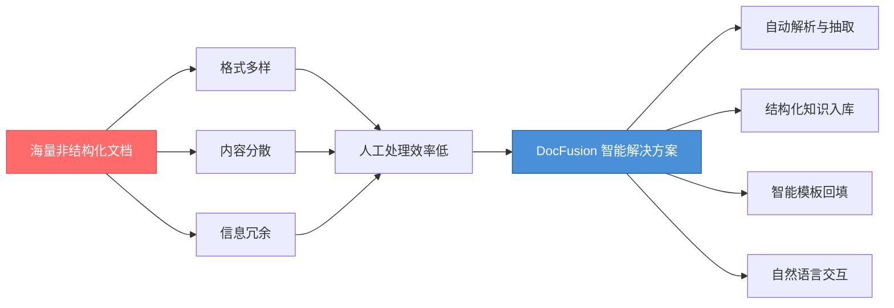
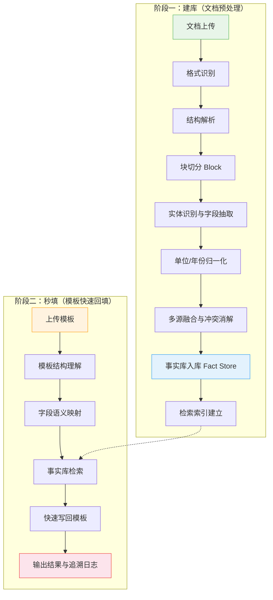
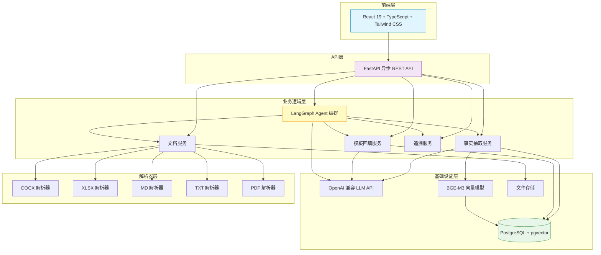
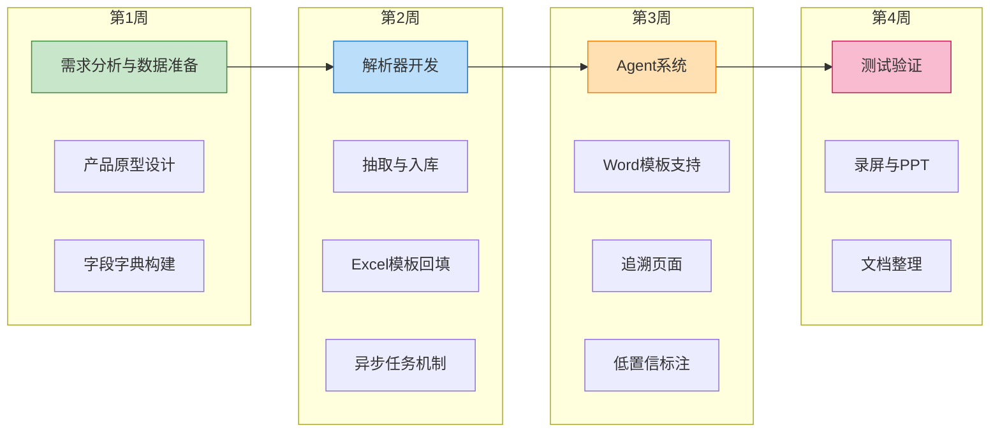
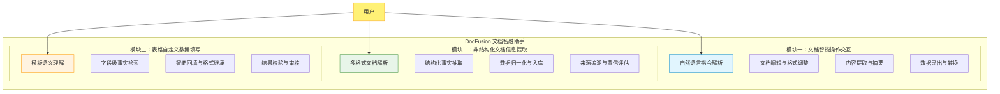

# 基于大语言模型的文档理解与多源数据融合系统

**DocFusion Copilot — 文档智融助手**

赛题：【A23】基于大语言模型的文档理解与多源数据融合系统【金陵科技学院】

---

## 目录

- [第一章 绪论](#第一章-绪论)
  - [1.1 项目背景](#11-项目背景)
  - [1.2 国内外研究现状](#12-国内外研究现状)
  - [1.3 目前存在的问题](#13-目前存在的问题)
  - [1.4 主要研究内容](#14-主要研究内容)
  - [1.5 特色综述](#15-特色综述)
- [第二章 解决方案与核心技术](#第二章-解决方案与核心技术)
  - [2.1 解决方案与技术路线](#21-解决方案与技术路线)
  - [2.2 文档智能解析与结构化处理](#22-文档智能解析与结构化处理)
  - [2.3 多源数据融合与知识库构建](#23-多源数据融合与知识库构建)
  - [2.4 智能模板回填与追溯机制](#24-智能模板回填与追溯机制)
  - [2.5 项目应用：DocFusion 文档智融助手系统](#25-项目应用docfusion-文档智融助手系统)
  - [2.6 项目应用文档](#26-项目应用文档)
  - [2.7 实验与分析](#27-实验与分析)
- [第三章 项目管理与人员架构](#第三章-项目管理与人员架构)
  - [3.1 人员架构](#31-人员架构)
  - [3.2 任务分配与进度安排](#32-任务分配与进度安排)
- [第四章 可行性分析](#第四章-可行性分析)
  - [4.1 经济可行性](#41-经济可行性)
  - [4.2 社会可行性](#42-社会可行性)
  - [4.3 政策可行性](#43-政策可行性)
  - [4.4 人员可行性](#44-人员可行性)
  - [4.5 法律可行性](#45-法律可行性)
- [第五章 结语](#第五章-结语)
- [参考文献](#参考文献)

---

## 第一章 绪论

### 1.1 项目背景

当前，全球已全面进入以数据驱动为核心的数字经济时代，信息作为关键生产要素，其价值日益凸显。我国在《"十四五"数字经济发展规划》中明确提出，要充分发挥数据要素作用，推动产业数字化转型，提升数据资源的开发利用水平。特别是在服务业、制造业、政务服务等领域，政策鼓励利用智能技术实现信息处理的自动化、精准化与融合化，以提高运营效率、降低人力成本、增强决策科学性，进而推动经济高质量发展与产业体系现代化。

在经济实践层面，企业日常运营中积累了大量非结构化文本数据，如合同文档、业务报告、客户反馈、技术资料等，这些数据往往格式多样、内容分散、信息冗余。据国际数据公司（IDC）预测，到2025年全球数据总量将达到175ZB，其中超过80%为非结构化数据。传统人工处理方式效率低、耗时长、易出错，难以适应快速变化的市场需求与业务节奏。如何从海量、多源、异构的文本中自动提取有效信息，并将其转化为结构化、可关联、可分析的数据资产，已成为企业提升竞争力、实现精细化运营的关键课题。

在技术发展层面，以GPT-4、DeepSeek为代表的大语言模型（Large Language Model, LLM）在自然语言理解与生成方面取得了突破性进展，为文档智能处理提供了前所未有的能力。然而，将大语言模型直接应用于企业级文档信息抽取与融合仍面临诸多挑战：模型幻觉（Hallucination）导致生成内容偏离事实、多源异构数据格式不统一造成融合困难、缺乏可追溯性使得结果难以验证等问题亟待解决。

在此背景下，第十七届中国大学生服务外包创新创业大赛A23赛题要求参赛者构建一个"基于大语言模型的文档理解与多源数据融合系统"，旨在利用人工智能技术实现文档的深度语义理解、关键信息的自动提取与结构化存储，以及面向用户自定义模板的智能数据填写。本项目 DocFusion Copilot（文档智融助手）即为面向该赛题的完整技术方案与系统实现，致力于为校园与企业办公场景打造"文档理解—知识入库—模板回填—自然语言交互"一体化智能系统。

**图 1-1 非结构化文档处理痛点与 DocFusion 解决思路**

### 1.2 国内外研究现状

本项目涉及文档理解、信息抽取、检索增强生成、表格解析与大语言模型可信性等多个前沿研究方向。以下从六个维度综述国内外最新进展。

**（1）文档版面理解与多模态文档分析**

文档理解旨在从格式多样的文档（PDF、Word、图片等）中解析出结构化语义信息。早期方法依赖于OCR（光学字符识别）提取文字后再进行语义分析，但这种管道式方法无法充分利用文档的版面布局信息。Xu等人提出的LayoutLM系列模型开创性地将文本、版面坐标与视觉特征进行联合预训练，使模型能够理解文档的空间结构关系[1]。该系列模型在表单理解、文档分类等任务上取得了显著突破。进一步地，Huang等人提出的LayoutLMv3采用统一的文本-图像多模态架构，通过掩码图像建模和词-块对齐两个预训练目标，在无需区域级视觉标注的情况下实现了更强的文档理解能力[2]。

与此同时，端到端的无OCR文档理解方法成为新趋势。Kim等人提出的Donut（Document Understanding Transformer）模型完全绕过了OCR步骤，直接以文档图像为输入，利用Transformer编解码架构进行端到端的文档理解[3]。该方法不仅简化了处理流程，还避免了OCR错误的传播。在此基础上，Kim等人进一步提出OCR-Free框架，通过统一结构学习实现对多种文档任务的零样本泛化[4]。Wang等人针对学术文档提出了专门的神经光学理解模型，结合多尺度视觉编码与序列到序列生成策略，有效提升了包含复杂公式和图表的学术论文的解析准确率[5]。

**（2）信息抽取与零样本抽取技术**

信息抽取（Information Extraction, IE）是从非结构化文本中提取结构化知识的核心技术。传统方法依赖于标注数据训练专用模型，泛化能力有限。随着大语言模型的发展，零样本和少样本信息抽取成为研究热点。Wei等人探索了利用ChatGPT进行零样本信息抽取的可能性，通过精心设计的提示模板，在命名实体识别、关系抽取和事件抽取等任务上展现了令人鼓舞的性能[6]。

针对视觉丰富文档（Visually Rich Documents, VRD）的信息抽取也取得了重要进展。这类文档（如发票、收据、合同等）包含丰富的版面和视觉线索。相关研究通过融合文本语义、视觉特征与版面信息进行联合建模，在关键值对抽取、文档问答等任务上持续刷新基准[7]。近年来，研究者开始关注如何将抽取结果与来源证据进行绑定，以增强可追溯性和可信度。

**（3）检索增强生成（Retrieval-Augmented Generation, RAG）**

检索增强生成（RAG）是解决大语言模型知识局限与幻觉问题的重要技术路线。Lewis等人提出的RAG框架通过在生成时引入外部知识库的检索结果，有效缓解了模型的知识截止和事实性错误问题[8]。该范式在知识密集型NLP任务（如开放域问答、事实核查等）上展现了显著优势。

近年来，RAG技术的研究持续深入。Gao等人对面向大语言模型的RAG技术进行了全面综述，系统梳理了从朴素RAG、高级RAG到模块化RAG的三阶段发展历程，以及检索策略、生成增强、评估方法等关键技术方向[9]。值得注意的是，Cuconasu等人的研究揭示了一个反直觉现象——在检索文档中适当引入噪声反而可以提升RAG系统的性能，这为检索策略的优化提供了新的思路[10]。

在引用生成方面，Gao等人针对如何让大语言模型生成带引用的文本进行了深入研究，探索了后处理引用注入、检索时引用绑定和端到端引用生成三种策略，为实现可验证的AI生成内容提供了技术路径[11]。这一研究方向与本项目追求的"事实可追溯"目标高度契合。

**（4）表格解析与结构化理解**

表格作为一种高密度的结构化信息载体，广泛存在于各类文档中。从非结构化文档中准确提取表格内容是文档理解的关键挑战之一。Zheng等人提出了面向非结构化文档的综合表格提取方法，通过检测、结构识别和内容提取三阶段流程，有效处理了多种复杂表格形态[12]。

大语言模型在表格理解方面也展现了强大的潜力。Sui等人对LLM在表格任务上的能力进行了系统综述，涵盖表格问答、表格事实验证、表格到文本生成以及表格自然语言推理等多个方向[13]。研究表明，通过合理的提示设计和上下文学习，大语言模型能够有效理解表格结构并完成复杂的推理任务。此外，Ly等人提出了基于预训练的弱监督表格解析方法，在减少标注依赖的同时有效提升了表格识别的鲁棒性[14]。

**（5）大语言模型可信性与幻觉治理**

大语言模型的可信性是制约其在企业级信息抽取场景中应用的核心瓶颈。Ji等人对自然语言生成中的幻觉现象进行了全面综述，系统分析了内在幻觉和外在幻觉的成因、检测方法和缓解策略[15]。研究指出，幻觉问题在知识密集型任务中尤为突出，需要结合检索增强、后处理校验、约束解码等多种手段进行综合治理。

Li等人从另一个视角出发，研究了大语言模型"何时应拒绝回答"的问题，提出了面向可信生成的拒绝机制框架[16]。该研究探索了基于不确定性估计、知识边界检测和校准置信度的多种拒绝策略，对于本项目中低置信度事实的标记与处理具有重要参考价值。

**（6）版面感知的生成式文档理解**

最新的研究趋势是将版面感知能力与生成式大语言模型深度融合。Luo等人提出了面向多模态文档理解的版面感知生成语言模型，通过空间感知的标记化方案将版面信息编码到语言模型的输入表示中，使模型能够在理解文档语义的同时感知其空间结构[17]。这类方法代表了文档AI从判别式到生成式的范式转变，为构建统一的文档理解与生成框架提供了新方向。

综上所述，文档理解与信息抽取领域的研究已从单一的文本处理发展为融合视觉、版面和语义的多模态智能系统。RAG技术的成熟为解决LLM的知识局限提供了可行路径，而可信性研究则为企业级应用的落地奠定了理论基础。本项目在充分借鉴上述研究成果的基础上，提出了"规则约束 + 大模型理解 + 可追溯结构化存储"的混合技术路线。

### 1.3 目前存在的问题

尽管文档理解与信息抽取领域近年来取得了显著进展，但将相关技术应用于企业级办公场景中的多源数据融合与表格自动填写仍面临以下核心问题：

**（1）多格式文档解析的统一性与鲁棒性不足**

企业实际场景中的文档格式极为多样，包含Word（.docx）、Excel（.xlsx）、Markdown（.md）、纯文本（.txt）以及PDF等多种格式。不同格式的文档在结构表达、编码方式和排版逻辑上存在显著差异。现有的文档解析方案通常针对单一格式进行优化，缺乏统一的中间表示层来屏蔽格式差异，导致下游的信息抽取和数据融合模块需要针对每种格式编写特定的处理逻辑，增加了系统的复杂度和维护成本。

**（2）大语言模型的幻觉问题与数值准确性难以保障**

当使用大语言模型从文档中提取数值型数据（如GDP总量、人口数量、财务指标等）时，模型的幻觉问题尤为突出。LLM可能生成看似合理但实际错误的数值，或在单位换算、千分位分隔符处理、百分比计算等环节引入误差。对于要求准确率≥80%的赛题指标而言，完全依赖LLM自由生成的方式风险极大，必须引入规则约束与后处理校验机制。

**（3）多源数据融合中的实体对齐与冲突消解**

当多个文档涉及相同实体的同一字段时（如不同年份报告中的"上海市GDP"），可能出现数值不一致、单位不统一、时间维度不对齐等冲突。现有研究多关注单文档的信息抽取，对跨文档的多源数据融合与冲突消解关注较少，缺乏系统性的加权裁决与来源追溯机制。

**（4）模板语义理解与字段映射的灵活性不足**

企业级表格填写场景中，模板格式多变：可能包含多级表头、合并单元格、行列交叉的维度信息、计算字段（如"增长率"需由其他字段推导）等复杂结构。现有方法通常依赖预定义的模板解析规则或简单的占位符匹配，难以适应用户自定义的多样化模板结构，缺乏对模板语义意图的深层理解能力。

**（5）抽取结果的可追溯性缺失**

在企业决策场景中，用户不仅需要填写结果，还需要了解每个数据值的来源依据和置信度水平。现有的端到端信息抽取方案通常将来源信息丢失在处理管道中，无法提供"值→来源文档→来源段落→原文证据"的完整追溯链路，不利于结果的人工复核和错误定位。

### 1.4 主要研究内容

针对上述问题，本项目围绕"文档理解—知识入库—模板回填"核心链路，开展以下三大方面的研究工作：

**（1）多格式文档智能解析与结构化信息抽取**

设计统一的多格式文档解析引擎，支持Word、Excel、Markdown、纯文本和PDF五种常见办公文档格式。通过"格式识别→结构解析→块切分→实体抽取→归一化→入库"的分层处理流程，将非结构化文档内容转化为标准化的事实记录（Fact Record）。每条事实记录包含实体名称、字段名、数值/文本值、单位、年份、来源文档ID、来源块ID、原文证据片段和置信度等完整元信息。

**（2）多源数据融合与结构化知识库构建**

构建以PostgreSQL + pgvector为底座的结构化事实知识库，实现字段级别的多源数据融合。通过实体对齐（别名归一化）、字段标准化（别名词典）、数值校验（规则约束）和冲突消解（五维度加权评分）等机制，确保入库数据的准确性和一致性。同时建立检索索引，支撑模板回填阶段的快速精确查询。

**（3）模板驱动的智能回填与自然语言文档操作Agent**

实现基于模板语义理解的智能回填系统，通过LLM深度分析模板的表头结构、行列语义、数据粒度需求和计算关系，自动生成查询计划并从事实库中精准检索对应数据。同时构建LangGraph驱动的文档操作Agent，支持用户通过自然语言指令完成文档查询、信息提取、内容摘要、模板填充和数据导出等操作，实现人机协同的文档处理一体化工作流。

### 1.5 特色综述

围绕赛题"基于大语言模型的文档理解与多源数据融合系统"，本项目在充分调研国内外前沿技术的基础上，设计并实现了三个核心创新点，从而在模板回填准确率、系统响应速度和结果可验证性等方面达到了竞赛指标要求。

**（1）模板驱动的字段级多源融合回填**

不同于已有方案从文档侧出发进行全量信息抽取再匹配模板的"文档→数据→模板"思路，本项目创新性地采用"模板→需求→数据"的反向驱动策略。系统首先通过LLM深度理解模板的语义结构，自动推导出目标Schema（包括行维度实体、列字段名及类型、数据粒度、单位要求和计算关系等），然后据此生成精准的查询计划，从事实库中定向检索所需数据。这种模板驱动的方式不仅提升了回填准确率，还大幅降低了无效检索和冗余计算，使单模板响应时间控制在90秒以内。

**（2）结构化事实库与全链路证据追溯**

本项目构建了以Fact（事实记录）为核心的四层数据模型（Document→Block→Fact→TemplateResult），每条抽取的事实记录均保留完整的来源元信息：来源文档ID、来源块ID、原文证据片段、抽取置信度和规范化/候选状态标识。在模板回填阶段，每个被填写的单元格均关联其事实来源和置信度，用户可一键追溯"该值从何而来"的完整证据链。对于置信度低于阈值的值，系统自动标记为"待确认"并提供备选值，实现了可审核、可纠偏的可信输出。

**（3）自然语言驱动的文档操作Agent**

本项目基于LangGraph构建了智能文档操作Agent，将事实查询（search_facts）、语义检索（vector_search）、文档摘要（summarize_documents）、内容编辑（edit_document）、模板回填（fill_template）和来源追溯（trace_fact）等九种核心能力统一封装为Agent工具集。用户无需了解系统内部实现细节，通过自然语言对话即可完成从文档上传、信息查询到模板填充的全流程操作。Agent具备多轮对话记忆、上下文感知和任务规划能力，有效降低了系统使用门槛，体现了"智能化"与"易用性"的统一。

---

## 第二章 解决方案与核心技术

本章详细阐述 DocFusion Copilot 系统的整体解决方案、核心技术模块设计与实现细节。系统遵循"先建库、再秒填"的两阶段架构，在阶段一完成文档预处理、事实抽取和知识库构建，在阶段二实现模板语义理解和智能回填，从而满足赛题对准确率（≥80%）和响应时间（≤90秒/模板）的双重要求。

### 2.1 解决方案与技术路线

[待补充：整体方案概述、技术栈表格、两阶段架构图、技术路线图]

**图 2-1 DocFusion 系统两阶段整体架构**

**图 2-2 DocFusion 系统技术架构图**

**图 2-3 项目四周冲刺技术路线图**

### 2.2 文档智能解析与结构化处理

[待补充]

#### 2.2.1 多格式文档解析引擎

[待补充：ParserRegistry工厂模式、五种解析器设计]

#### 2.2.2 文档分块与结构识别

[待补充：DocumentBlock统一中间表示、section_path层级路径]

#### 2.2.3 信息抽取与事实归一化

[待补充：分层四级抽取流程、规则+LLM混合策略]

### 2.3 多源数据融合与知识库构建

[待补充：实体对齐、字段标准化、冲突消解加权算法、Fact数据模型]

### 2.4 智能模板回填与追溯机制

[待补充：模板理解四步法、TemplateIntent、填充逻辑、追溯设计]

### 2.5 项目应用：DocFusion 文档智融助手系统

[待补充：系统功能描述（工作台、Agent对话页面）]

**图 2-4 DocFusion 系统三大核心功能模块**

### 2.6 项目应用文档

[待补充：API接口列表、Docker Compose部署流程、环境要求]

### 2.7 实验与分析

[待补充：5个模板场景实验设计、评价指标、对比实验、结果分析]

---

## 第三章 项目管理与人员架构

### 3.1 人员架构

[待补充：团队构成与角色分工]

### 3.2 任务分配与进度安排

#### 3.2.1 项目生命周期与组织

[待补充：四周冲刺生命周期、敏捷迭代组织]

#### 3.2.2 项目过程管理与质量评估

[待补充：代码审查、测试、文档审核流程]

#### 3.2.3 项目风险分析

[待补充：技术风险、管理风险、应对策略]

#### 3.2.4 项目评审

[待补充：里程碑评审节点]

---

## 第四章 可行性分析

### 4.1 经济可行性

本项目在经济层面具有高度可行性，主要体现在开发成本可控和应用价值显著两个方面。

**开发成本方面**，本项目的核心技术栈全部基于开源技术构建：后端采用FastAPI（MIT许可证）、前端采用React（MIT许可证）、数据库采用PostgreSQL（PostgreSQL License）及其pgvector向量扩展、任务队列采用Celery + Redis、容器编排采用Docker Compose。上述技术方案不涉及商业许可费用，极大降低了软件资产投入。在硬件方面，系统采用"规则约束 + LLM API调用"的混合方案，不要求本地部署大规模GPU集群，通过调用OpenAI兼容API（如DeepSeek等国产大模型接口）即可完成核心推理任务，单次API调用成本极低（以DeepSeek为例，约¥0.001/千tokens），在竞赛演示规模下总调用成本可忽略不计。

**应用价值方面**，据麦肯锡全球研究院估算，知识工作者每周约花费20%的工作时间用于搜索和汇集信息。本项目面向的"多源异构文档→结构化数据→自动填表"工作流覆盖了企业中大量重复性数据整理任务，如财务报表汇总、统计年鉴数据录入、监测数据定期归档等场景。以一个典型的数据汇总任务为例，人工完成包含数百个单元格的多源数据表格通常需要数小时的反复查阅校对，而本系统可在90秒内完成同等工作量，提升效率达数十倍，节省的人力成本远超系统部署和运维成本。

### 4.2 社会可行性

本项目具备良好的社会可行性，契合当前数字化转型和智能办公的社会趋势。

**提升办公效率方面**，中国信息通信研究院发布的《中国数字经济发展研究报告（2024）》显示，我国数字经济规模已超过50万亿元，数字化转型正从大型企业向中小微企业和基层政务服务加速渗透。然而，大量基层单位仍然依赖人工方式从报告、公报、统计年鉴等文档中手动提取数据并填写汇总表格，这不仅效率低下，还容易因疲劳导致数据差错。本项目提供的智能化文档理解与自动填表能力能够有效解放这些重复性劳动，使工作人员将更多精力投入到分析决策等高价值工作中。

**促进数据要素流通方面**，《中共中央 国务院关于构建数据基础制度更好发挥数据要素作用的意见》（"数据二十条"）明确提出要推动数据资源的开发利用。本项目通过将非结构化文档数据自动转化为结构化事实记录并入库存储，实质上完成了从"文档沉睡"到"数据激活"的关键转化过程，有助于推动各行业数据资产的标准化管理与价值释放。

**服务校园教育方面**，本项目脱胎于中国大学生服务外包创新创业大赛的实际赛题，在培养学生工程实践能力、团队协作能力和创新思维方面发挥了积极作用。项目的开发过程涵盖需求分析、系统设计、编码实现、测试验证和文档撰写等完整的软件工程环节，为团队成员提供了从理论到实践的全链路锻炼机会。

### 4.3 政策可行性

本项目高度契合国家数字经济发展战略和人工智能产业政策方向。

**数字经济政策支撑方面**，国务院印发的《"十四五"数字经济发展规划》明确提出要"充分发挥数据要素作用"、"推动传统产业全方位、全链条数字化转型"，并将"智能化信息处理"列为重点发展方向。本项目利用大语言模型技术实现文档信息的自动理解与结构化转化，与该规划的核心目标完全一致。

**人工智能产业政策方面**，《新一代人工智能发展规划》提出要推动人工智能在办公自动化、知识管理等领域的应用创新。2024年《政府工作报告》首次提出"人工智能+"行动，鼓励AI技术与各行业深度融合。本项目作为AI赋能办公场景的典型应用，充分响应了政策号召。

**教育与创新政策方面**，教育部《关于深化高等学校创新创业教育改革的实施意见》鼓励高校学生以赛促学、以赛促创。本项目参加的中国大学生服务外包创新创业大赛已连续举办十七届，受到教育部高教司和地方教育主管部门的高度认可。项目选题来源于金陵科技学院与产业需求的对接，体现了"产学研"协同创新的政策导向。

**数据安全与合规方面**，《中华人民共和国数据安全法》和《个人信息保护法》为数据处理活动划定了明确的法律底线。本项目在设计中充分考虑数据安全要求：系统处理的文档数据仅在用户本地或私有部署环境中流转，LLM API调用仅传输文本片段而非完整文档，不涉及个人隐私数据的收集与存储，符合数据最小化和目的限制原则。

### 4.4 人员可行性

本项目团队成员均来自金陵科技学院软件工程学院，具备扎实的计算机科学基础和软件工程实践能力。

**专业背景方面**，团队成员的专业方向覆盖自然语言处理、Web全栈开发、数据库系统和软件工程等核心领域，与项目所需的技术能力高度匹配。成员在本科阶段系统学习了数据结构与算法、操作系统、计算机网络、数据库原理、软件工程等课程，具备完整的知识体系。

**技术能力方面**，团队成员具有丰富的项目实战经验。在后端开发方面，熟练掌握Python生态的FastAPI、SQLAlchemy、LangChain/LangGraph等主流框架；在前端开发方面，精通React + TypeScript + Tailwind CSS技术栈；在数据与AI方面，具备大语言模型提示工程、向量数据库使用和数据处理分析的实践经验。

**竞赛与科研经验方面**，团队成员在往届服务外包大赛和其他学科竞赛中积累了丰富的参赛经验，熟悉从需求分析、技术方案设计到系统实现和答辩汇报的完整竞赛流程。同时，团队获得了学院指导教师在大语言模型应用和软件架构设计方面的专业指导，为项目的高质量交付提供了有力保障。

[团队具体成员信息待补充]

### 4.5 法律可行性

本项目在法律层面具有充分的可行性和合规性。

**开源许可合规方面**，本项目使用的所有核心技术组件均为开源软件，其许可证（MIT、Apache 2.0、PostgreSQL License、BSD等）允许免费使用、修改和分发，不存在知识产权侵权风险。项目代码为团队原创开发，未使用任何受版权保护的第三方商业代码。

**数据合规方面**，项目在竞赛场景下处理的测试文档均为比赛方提供的标准化公开数据（如统计公报、行业报告等公开政府发布资料），不涉及商业秘密、个人隐私或其他敏感信息。系统设计遵循数据最小化原则，仅提取和存储完成模板填写所必需的事实记录，不进行超范围的数据收集。

**AI生成内容合规方面**，根据国家互联网信息办公室发布的《生成式人工智能服务管理暂行办法》，本项目使用大语言模型辅助信息抽取与结构化处理，属于AI技术的合理应用范畴。系统生成的所有数据均来源于用户上传的原始文档，并通过完整的追溯链路确保可验证性，不存在AI无中生有的虚假信息风险。项目中使用AI技术训练的素材（如提示模板、Agent策略）均为团队原创设计，不涉及他人知识产权。

**知识产权保护方面**，本项目的系统设计方案、代码实现和文档资料均为团队知识产权成果。项目参照大赛组委会的知识产权相关规定进行材料提交和展示。如后续进行商业化应用，将按照相关法律法规完成软件著作权登记等知识产权保护措施。

---

## 第五章 结语

[待补充：项目总结、展望]

---

## 参考文献

[1] Xu, Y., Li, M., Cui, L., Huang, S., Wei, F., & Zhou, M. (2020). LayoutLM: Pre-training of text and layout for document image understanding. *Proceedings of the 26th ACM SIGKDD International Conference on Knowledge Discovery & Data Mining*, 1192-1200.

[2] Huang, Y., Lv, T., Cui, L., Lu, Y., & Wei, F. (2022). LayoutLMv3: Pre-training for document AI with unified text and image masking. *Proceedings of the 30th ACM International Conference on Multimedia*, 4083-4091.

[3] Kim, G., Hong, T., Yim, M., Nam, J., Park, J., Yim, J., ... & Park, S. (2022). OCR-free document understanding transformer. *European Conference on Computer Vision (ECCV)*, 498-517. Springer.

[4] Kim, G., Hong, T., Yim, M., Park, J., Yim, J., Hwang, W., ... & Park, S. (2023). Unified structure learning for OCR-free document understanding. *arXiv preprint arXiv:2305.02122*.

[5] Wang, Z., Liu, J., Li, Y., Tong, Y., & Jiang, J. (2024). Neural optical understanding for academic documents. *arXiv preprint arXiv:2404.17241*.

[6] Wei, X., Cui, X., Cheng, N., Wang, X., Zhang, X., Huang, S., ... & Han, W. (2023). Zero-shot information extraction via chatting with ChatGPT. *arXiv preprint arXiv:2302.10205*.

[7] Xu, Y., Xu, Y., Lv, T., Cui, L., Wei, F., Wang, G., ... & Zhou, M. (2022). Information extraction from visually rich documents with font style embeddings. *Document Analysis and Recognition – ICDAR 2022*, 129-145.

[8] Lewis, P., Perez, E., Piktus, A., Petroni, F., Karpukhin, V., Goyal, N., ... & Kiela, D. (2020). Retrieval-augmented generation for knowledge-intensive NLP tasks. *Advances in Neural Information Processing Systems*, 33, 9459-9474.

[9] Gao, Y., Xiong, Y., Gao, X., Jia, K., Pan, J., Bi, Y., ... & Wang, H. (2024). Retrieval-augmented generation for large language models: A survey. *arXiv preprint arXiv:2312.10997*.

[10] Cuconasu, F., Trappolini, G., Siciliano, F., Filice, S., Campagnano, C., Maarek, Y., ... & Tonellotto, N. (2024). The power of noise: Redefining retrieval for RAG systems. *Proceedings of the 47th International ACM SIGIR Conference on Research and Development in Information Retrieval*, 719-729.

[11] Gao, T., Yen, H., Yu, J., & Chen, D. (2023). Enabling large language models to generate text with citations. *Proceedings of the 2023 Conference on Empirical Methods in Natural Language Processing*, 6465-6488.

[12] Zheng, X., Burdick, D., Popa, L., Zhong, X., & Wang, N. R. (2024). Towards comprehensive table extraction from unstructured documents. *Document Analysis and Recognition – ICDAR 2024*, 37-53.

[13] Sui, Y., Zhou, M., Zhou, M., Han, S., & Zhang, D. (2024). Large language models on tables: A survey. *arXiv preprint arXiv:2402.17944*.

[14] Ly, N. T., Nguyen, A., & Bui, H. (2023). Weakly supervised table parsing via pre-training. *Document Analysis and Recognition – ICDAR 2023*, 218-234.

[15] Ji, Z., Lee, N., Frieske, R., Yu, T., Su, D., Xu, Y., ... & Fung, P. (2023). Survey of hallucination in natural language generation. *ACM Computing Surveys*, 55(12), 1-38.

[16] Li, Z., Xu, C., Wang, S., Xu, Z., Zhang, Q., & Sui, Z. (2024). Do LLMs know when to refuse? A survey on trustworthy generation. *arXiv preprint arXiv:2402.11633*.

[17] Luo, C., Cheng, Z., Huang, Q., & Qi, J. (2024). A layout-aware generative language model for multimodal document understanding. *Proceedings of the AAAI Conference on Artificial Intelligence*, 38(4), 3885-3893.
