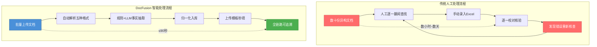
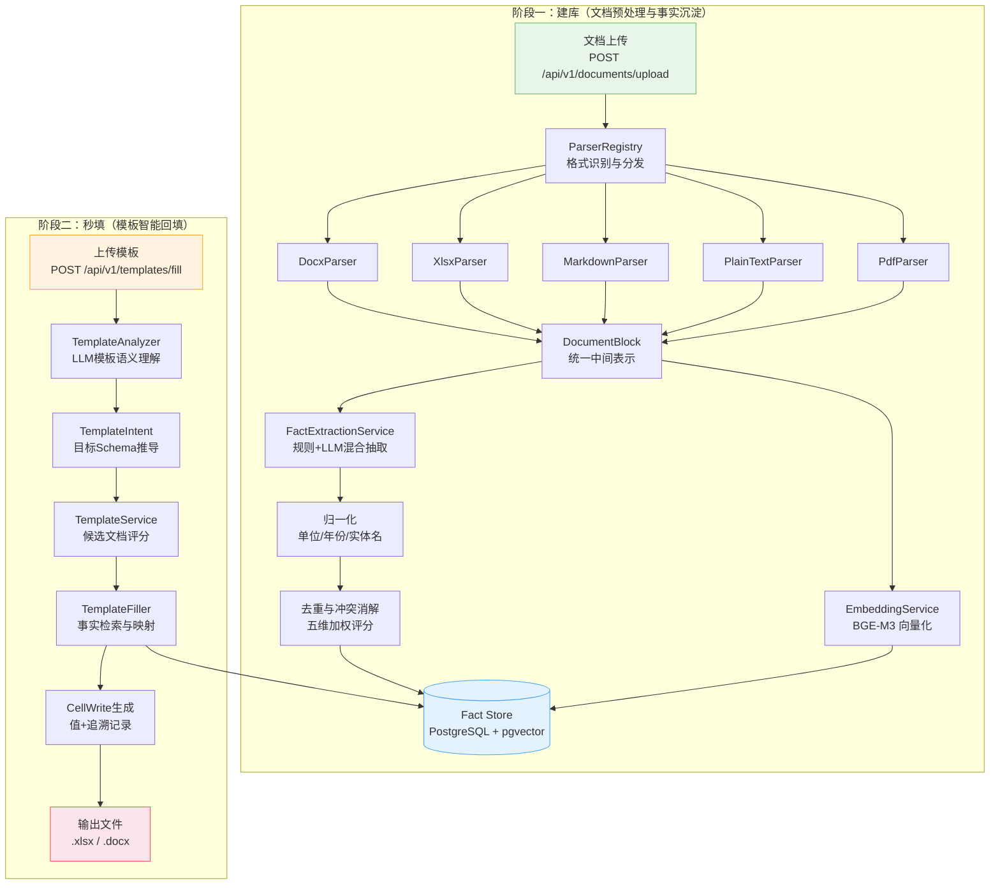
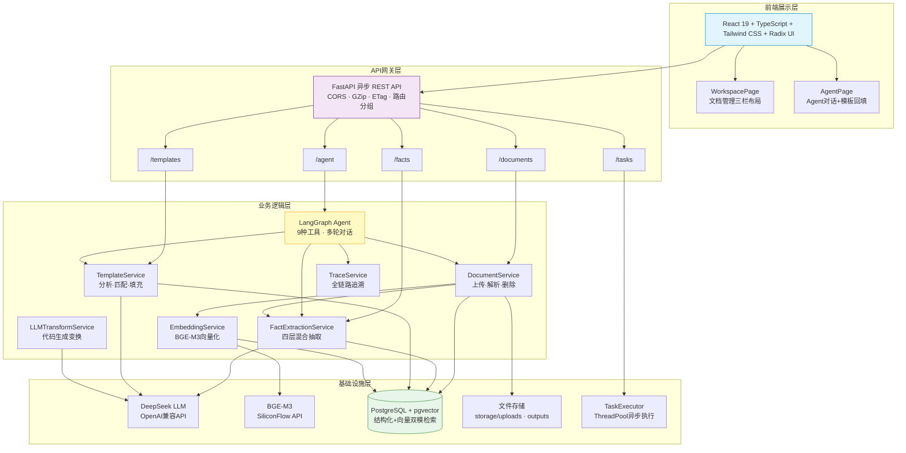
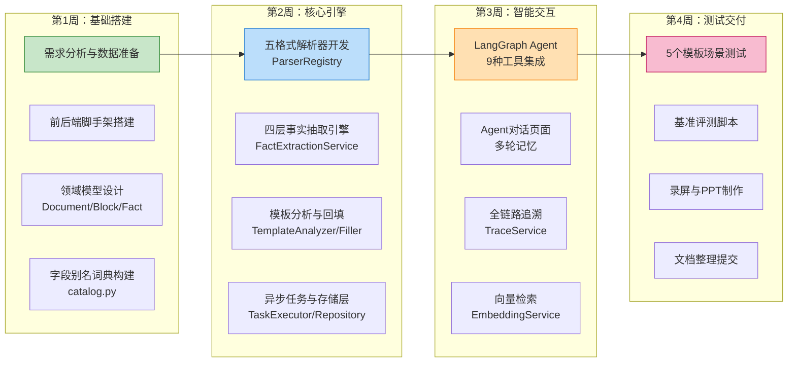
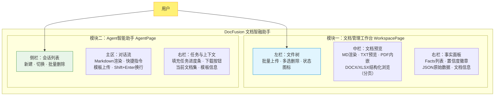

# 基于大语言模型的文档理解与多源数据融合系统

**DocFusion Copilot — 文档智融助手**

赛题：【A23】基于大语言模型的文档理解与多源数据融合系统【金陵科技学院】

---

## 目录

- [第一章 绪论](#第一章-绪论)
  - [1.1 项目背景](#11-项目背景)
  - [1.2 国内外研究现状](#12-国内外研究现状)
  - [1.3 目前存在的问题](#13-目前存在的问题)
  - [1.4 主要研究内容](#14-主要研究内容)
  - [1.5 特色综述](#15-特色综述)
- [第二章 解决方案与核心技术](#第二章-解决方案与核心技术)
  - [2.1 解决方案与技术路线](#21-解决方案与技术路线)
    - [2.1.1 整体方案概述](#211-整体方案概述)
    - [2.1.2 系统技术架构](#212-系统技术架构)
    - [2.1.3 项目目录结构](#213-项目目录结构)
    - [2.1.4 技术路线图](#214-技术路线图)
  - [2.2 文档智能解析与结构化处理](#22-文档智能解析与结构化处理)
    - [2.2.1 统一中间表示：DocumentBlock模型](#221-统一中间表示documentblock模型)
    - [2.2.2 多格式文档解析引擎：ParserRegistry](#222-多格式文档解析引擎parserregistry)
    - [2.2.3 信息抽取与事实归一化](#223-信息抽取与事实归一化)
  - [2.3 多源数据融合与知识库构建](#23-多源数据融合与知识库构建)
    - [2.3.1 实体对齐与字段标准化](#231-实体对齐与字段标准化)
    - [2.3.2 冲突消解与标准值选举](#232-冲突消解与标准值选举)
    - [2.3.3 向量检索索引](#233-向量检索索引)
  - [2.4 智能模板回填与追溯机制](#24-智能模板回填与追溯机制)
    - [2.4.1 模板语义理解：TemplateAnalyzer](#241-模板语义理解templateanalyzer)
    - [2.4.2 候选文档评分与匹配](#242-候选文档评分与匹配)
    - [2.4.3 模板填充引擎：TemplateFiller](#243-模板填充引擎templatefiller)
    - [2.4.4 全链路证据追溯](#244-全链路证据追溯)
  - [2.5 项目应用：DocFusion 文档智融助手系统](#25-项目应用docfusion-文档智融助手系统)
    - [2.5.1 文档管理工作台](#251-文档管理工作台)
    - [2.5.2 Agent智能助手](#252-agent智能助手)
  - [2.6 项目应用文档](#26-项目应用文档)
    - [2.6.1 API接口总览](#261-api接口总览)
    - [2.6.2 部署方式](#262-部署方式)
  - [2.7 实验与分析](#27-实验与分析)
- [第三章 项目管理与人员架构](#第三章-项目管理与人员架构)
  - [3.1 人员架构](#31-人员架构)
  - [3.2 任务分配与进度安排](#32-任务分配与进度安排)
- [第四章 可行性分析](#第四章-可行性分析)
  - [4.1 经济可行性](#41-经济可行性)
  - [4.2 社会可行性](#42-社会可行性)
  - [4.3 政策可行性](#43-政策可行性)
  - [4.4 人员可行性](#44-人员可行性)
  - [4.5 法律可行性](#45-法律可行性)
- [第五章 结语](#第五章-结语)
- [参考文献](#参考文献)

---

## 第一章 绪论

### 1.1 项目背景

当前，全球已全面进入以数据驱动为核心的数字经济时代，信息作为关键生产要素，其价值日益凸显。我国在《"十四五"数字经济发展规划》中明确提出，要充分发挥数据要素作用，推动产业数字化转型，提升数据资源的开发利用水平。特别是在服务业、制造业、政务服务等领域，政策鼓励利用智能技术实现信息处理的自动化、精准化与融合化，以提高运营效率、降低人力成本、增强决策科学性，进而推动经济高质量发展与产业体系现代化。

在经济实践层面，各级政府机关、统计局、行业协会和企事业单位每年发布大量统计公报、行业报告和业务文档，这些数据沉睡在Word、Excel、PDF、Markdown、纯文本等五花八门的格式中，内容分散在数十甚至上百份独立文件里。据国际数据公司（IDC）预测，到2025年全球数据总量将达到175ZB，其中超过80%为非结构化数据。一个典型的工作场景是：基层统计人员需要从《国民经济和社会发展统计公报》《卫生健康事业发展统计公报》《药品流通行业运行统计分析报告》等数十份异构文档中，手动查找特定指标（如GDP、人口、医疗机构数等），完成一张百余个单元格的汇总Excel模板。这一过程通常需要耗费数小时甚至数天的反复翻阅、手动录入与逐一校对，效率极低、极易出错，且无法追溯数据来源——一旦发现填写错误，往往需要重新从头核查。

**这一痛点的核心难度在于：它不是简单的"复制粘贴"问题，而是一个涉及多格式解析、跨文档实体对齐、数值归一化、冲突消解与语义映射的复合型信息融合挑战。** 具体而言，同一个指标"上海市GDP"可能在不同文档中以"地区生产总值""GDP总量""国内生产总值"等不同字段名出现，单位可能为"亿元""万亿元""百万元"，年份可能写在标题、表头、正文或脚注中，而合并单元格、多级表头、行列交叉维度等复杂表格结构更是让自动化处理雪上加霜。

在技术发展层面，以GPT-4、DeepSeek为代表的大语言模型（Large Language Model, LLM）在自然语言理解与生成方面取得了突破性进展，为文档智能处理提供了前所未有的能力。然而，**将大语言模型直接应用于此类精确数值提取场景面临三大致命瓶颈**：（1）**幻觉问题**——LLM可能生成看似合理但完全错误的数值（如将"12345.6亿元"幻觉为"1234.56亿元"），对于要求准确率≥80%的赛题指标而言风险极大；（2）**格式盲区**——纯文本LLM无法理解Excel合并单元格、Word表格跨行跨列、PDF排版坐标等结构信息；（3）**不可追溯**——LLM生成的答案无法提供"该值从哪份文档的哪个段落/单元格提取而来"的证据链，用户无从验证。

在此背景下，第十七届中国大学生服务外包创新创业大赛A23赛题要求参赛者构建一个"基于大语言模型的文档理解与多源数据融合系统"，旨在利用人工智能技术实现文档的深度语义理解、关键信息的自动提取与结构化存储，以及面向用户自定义模板的智能数据填写。**本项目 DocFusion Copilot（文档智融助手）即为面向该赛题的完整技术方案与系统实现**，采用"规则约束 + 大模型理解 + 可追溯结构化存储"的混合技术路线，创新性地提出"先建库、再秒填"的两阶段架构——阶段一将多源异构文档解析、抽取、归一化为结构化事实记录并入库，阶段二在用户上传模板后通过语义理解自动匹配、检索、回填，实现从"数小时人工翻阅"到"90秒自动完成"的效率跃迁，致力于为校园与企业办公场景打造"文档理解—知识入库—模板回填—自然语言交互"一体化智能系统。



**图 1-1 传统人工处理与 DocFusion 智能处理流程对比**

### 1.2 国内外研究现状

本项目涉及文档理解、信息抽取、检索增强生成、表格解析与大语言模型可信性等多个前沿研究方向。以下从六个维度综述国内外最新进展。

**（1）文档版面理解与多模态文档分析**

文档理解旨在从格式多样的文档（PDF、Word、图片等）中解析出结构化语义信息。早期方法依赖于OCR（光学字符识别）提取文字后再进行语义分析，但这种管道式方法无法充分利用文档的版面布局信息。Xu等人提出的LayoutLM系列模型开创性地将文本、版面坐标与视觉特征进行联合预训练，使模型能够理解文档的空间结构关系<sup>[1]</sup>。该系列模型在表单理解、文档分类等任务上取得了显著突破。进一步地，Huang等人提出的LayoutLMv3采用统一的文本-图像多模态架构，通过掩码图像建模和词-块对齐两个预训练目标，在无需区域级视觉标注的情况下实现了更强的文档理解能力<sup>[2]</sup>。

与此同时，端到端的无OCR文档理解方法成为新趋势。Kim等人提出的Donut（Document Understanding Transformer）模型完全绕过了OCR步骤，直接以文档图像为输入，利用Transformer编解码架构进行端到端的文档理解<sup>[3]</sup>。该方法不仅简化了处理流程，还避免了OCR错误的传播。在此基础上，Kim等人进一步提出OCR-Free框架，通过统一结构学习实现对多种文档任务的零样本泛化<sup>[4]</sup>。Wang等人针对学术文档提出了专门的神经光学理解模型，结合多尺度视觉编码与序列到序列生成策略，有效提升了包含复杂公式和图表的学术论文的解析准确率<sup>[5]</sup>。

**（2）信息抽取与零样本抽取技术**

信息抽取（Information Extraction, IE）是从非结构化文本中提取结构化知识的核心技术。传统方法依赖于标注数据训练专用模型，泛化能力有限。随着大语言模型的发展，零样本和少样本信息抽取成为研究热点。Wei等人探索了利用ChatGPT进行零样本信息抽取的可能性，通过精心设计的提示模板，在命名实体识别、关系抽取和事件抽取等任务上展现了令人鼓舞的性能<sup>[6]</sup>。

针对视觉丰富文档（Visually Rich Documents, VRD）的信息抽取也取得了重要进展。这类文档（如发票、收据、合同等）包含丰富的版面和视觉线索。相关研究通过融合文本语义、视觉特征与版面信息进行联合建模，在关键值对抽取、文档问答等任务上持续刷新基准<sup>[7]</sup>。近年来，研究者开始关注如何将抽取结果与来源证据进行绑定，以增强可追溯性和可信度。

**（3）检索增强生成（Retrieval-Augmented Generation, RAG）**

检索增强生成（RAG）是解决大语言模型知识局限与幻觉问题的重要技术路线。Lewis等人提出的RAG框架通过在生成时引入外部知识库的检索结果，有效缓解了模型的知识截止和事实性错误问题<sup>[8]</sup>。该范式在知识密集型NLP任务（如开放域问答、事实核查等）上展现了显著优势。

近年来，RAG技术的研究持续深入。Gao等人对面向大语言模型的RAG技术进行了全面综述，系统梳理了从朴素RAG、高级RAG到模块化RAG的三阶段发展历程，以及检索策略、生成增强、评估方法等关键技术方向<sup>[9]</sup>。值得注意的是，Cuconasu等人的研究揭示了一个反直觉现象——在检索文档中适当引入噪声反而可以提升RAG系统的性能，这为检索策略的优化提供了新的思路<sup>[10]</sup>。

在引用生成方面，Gao等人针对如何让大语言模型生成带引用的文本进行了深入研究，探索了后处理引用注入、检索时引用绑定和端到端引用生成三种策略，为实现可验证的AI生成内容提供了技术路径<sup>[11]</sup>。这一研究方向与本项目追求的"事实可追溯"目标高度契合。

**（4）表格解析与结构化理解**

表格作为一种高密度的结构化信息载体，广泛存在于各类文档中。从非结构化文档中准确提取表格内容是文档理解的关键挑战之一。Zheng等人提出了面向非结构化文档的综合表格提取方法，通过检测、结构识别和内容提取三阶段流程，有效处理了多种复杂表格形态<sup>[12]</sup>。

大语言模型在表格理解方面也展现了强大的潜力。Sui等人对LLM在表格任务上的能力进行了系统综述，涵盖表格问答、表格事实验证、表格到文本生成以及表格自然语言推理等多个方向<sup>[13]</sup>。研究表明，通过合理的提示设计和上下文学习，大语言模型能够有效理解表格结构并完成复杂的推理任务。此外，Ly等人提出了基于预训练的弱监督表格解析方法，在减少标注依赖的同时有效提升了表格识别的鲁棒性<sup>[14]</sup>。

**（5）大语言模型可信性与幻觉治理**

大语言模型的可信性是制约其在企业级信息抽取场景中应用的核心瓶颈。Ji等人对自然语言生成中的幻觉现象进行了全面综述，系统分析了内在幻觉和外在幻觉的成因、检测方法和缓解策略<sup>[15]</sup>。研究指出，幻觉问题在知识密集型任务中尤为突出，需要结合检索增强、后处理校验、约束解码等多种手段进行综合治理。

Li等人从另一个视角出发，研究了大语言模型"何时应拒绝回答"的问题，提出了面向可信生成的拒绝机制框架<sup>[16]</sup>。该研究探索了基于不确定性估计、知识边界检测和校准置信度的多种拒绝策略，对于本项目中低置信度事实的标记与处理具有重要参考价值。

**（6）版面感知的生成式文档理解**

最新的研究趋势是将版面感知能力与生成式大语言模型深度融合。Luo等人提出了面向多模态文档理解的版面感知生成语言模型，通过空间感知的标记化方案将版面信息编码到语言模型的输入表示中，使模型能够在理解文档语义的同时感知其空间结构<sup>[17]</sup>。这类方法代表了文档AI从判别式到生成式的范式转变，为构建统一的文档理解与生成框架提供了新方向。

综上所述，文档理解与信息抽取领域的研究已从单一的文本处理发展为融合视觉、版面和语义的多模态智能系统。RAG技术的成熟为解决LLM的知识局限提供了可行路径，而可信性研究则为企业级应用的落地奠定了理论基础。本项目在充分借鉴上述研究成果的基础上，提出了"规则约束 + 大模型理解 + 可追溯结构化存储"的混合技术路线。

### 1.3 目前存在的问题

尽管文档理解与信息抽取领域近年来取得了显著进展，但将相关技术应用于实际办公场景中的多源数据融合与表格自动填写仍面临以下核心难题，**这些问题的叠加效应使得"自动从多文档填一张表"至今仍是一个未被很好解决的工程问题**：

**（1）多格式文档解析的统一性与鲁棒性不足——"五种格式五套逻辑"困境**

实际场景中的文档格式极为多样，仅本赛题测试集就涉及Word（.docx）、Excel（.xlsx）、Markdown（.md）、纯文本（.txt）和PDF五种格式。**这些格式在结构表达上存在根本性差异**：Excel以行列单元格组织数据且可能包含复杂的合并单元格和多级表头；Word文档以段落-表格混排呈现，表格可能存在垂直/水平合并（vMerge/gridSpan）；Markdown以轻量标记表示层级；纯文本靠缩进和编号暗示结构；PDF则完全基于坐标定位，丧失了逻辑结构信息。现有方案通常针对单一格式优化（如LayoutLM系列专注PDF/图像，python-docx仅处理Word），**缺乏统一的中间表示层（Intermediate Representation）**来屏蔽格式差异——这意味着下游的信息抽取模块需要为每种格式维护独立的处理逻辑，系统复杂度随格式数量呈乘数增长。

**（2）大语言模型的幻觉问题——"看似正确实则致命"的数值错误**

当LLM从文档中提取数值型数据时，幻觉问题尤为危险。**与自由对话中的幻觉不同，数据填表场景的幻觉代价极高**：将"12345.6亿元"错读为"1234.56亿元"就是10倍量级的差错，但从文本表面看两者几乎无法区分。实测表明，LLM在以下环节极易引入误差：（a）千分位分隔符处理——"1,234.5"可能被解析为"1234.5"或"1.2345"；（b）单位换算——"万亿元"与"亿元"之间的1万倍系数容易遗漏；（c）百分比与绝对值混淆——"增长6.5%"可能被提取为数值"6.5"；（d）上下文串扰——表格中相邻行的数值可能在提取时发生"张冠李戴"。对于赛题要求的准确率≥80%指标而言，纯LLM自由生成方案根本无法满足要求，**必须引入确定性规则约束与多层后处理校验机制**。

**（3）多源数据融合中的实体对齐与冲突消解——"同一指标，多种说法"**

当多个文档涉及相同实体的同一字段时，冲突不可避免。以"上海市GDP"为例，在《国民经济和社会发展统计公报》中可能标记为"地区生产总值 47218.66 亿元"，在城市经济百强报告中可能写作"GDP 4.72万亿元"，在行业分析报告正文中可能表述为"上海GDP突破4.7万亿"。**这三个数值实际上是同一事实的三种不同表达，但在字段名（"地区生产总值"vs"GDP"）、单位（"亿元"vs"万亿元"）、精度（47218.66 vs 4.72万 vs 4.7万）上均不一致。** 现有研究多关注单文档信息抽取，对跨文档的多源数据融合缺乏系统性方案——需要同时解决实体别名归一化（"上海市"="上海"）、字段名标准化（"GDP总量"="地区生产总值"）、单位统一换算、精度选择裁决和来源优先级评估等五个维度的对齐问题。

**（4）模板语义理解与字段映射——"机器读不懂表头含义"**

企业级表格模板的复杂度远超简单的占位符替换。**一张典型的汇总模板可能同时包含**：多级表头（"2024年/GDP/总量"三层嵌套）、合并单元格（跨多列的分类标题）、行列交叉维度（行为城市名、列为指标名、交叉处为数值）、计算字段（"增长率"需由本年值和上年值推导）以及格式约束（保留两位小数、千分位逗号等）。现有方法要么依赖 `{{placeholder}}` 占位符硬编码（无法适应未见过的模板），要么完全依赖LLM自由理解（准确率不稳定），**缺乏对模板语义意图（Template Intent）的系统化建模与结构化输出能力**。

### 1.4 主要研究内容

针对上述问题，本项目围绕"文档理解—知识入库—模板回填"核心链路，开展以下三大方面的研究工作：

**（1）多格式文档智能解析与结构化信息抽取**

设计统一的多格式文档解析引擎，支持Word、Excel、Markdown、纯文本和PDF五种常见办公文档格式。通过"格式识别→结构解析→块切分→实体抽取→归一化→入库"的分层处理流程，将非结构化文档内容转化为标准化的事实记录（Fact Record）。每条事实记录包含实体名称、字段名、数值/文本值、单位、年份、来源文档ID、来源块ID、原文证据片段和置信度等完整元信息。

**（2）多源数据融合与结构化知识库构建**

构建以PostgreSQL + pgvector为底座的结构化事实知识库，实现字段级别的多源数据融合。通过实体对齐（别名归一化）、字段标准化（别名词典）、数值校验（规则约束）和冲突消解（五维度加权评分）等机制，确保入库数据的准确性和一致性。同时建立检索索引，支撑模板回填阶段的快速精确查询。

**（3）模板驱动的智能回填与自然语言文档操作Agent**

实现基于模板语义理解的智能回填系统，通过LLM深度分析模板的表头结构、行列语义、数据粒度需求和计算关系，自动生成查询计划并从事实库中精准检索对应数据。同时构建LangGraph驱动的文档操作Agent，支持用户通过自然语言指令完成文档查询、信息提取、内容摘要、模板填充和数据导出等操作，实现人机协同的文档处理一体化工作流。

### 1.5 特色综述

围绕赛题"基于大语言模型的文档理解与多源数据融合系统"，本项目在充分调研国内外前沿技术的基础上，设计并实现了四个核心创新点，**从架构思路、数据治理、交互范式和工程实现四个维度构建了区别于现有方案的差异化竞争优势**。

**（1）创新点一：先建库再秒填——模板驱动的反向融合架构**

不同于已有方案从文档侧出发进行全量信息抽取再匹配模板的"文档→数据→模板"思路，本项目创新性地采用**"两阶段分离+模板反向驱动"**策略。阶段一（建库）在文档上传时即完成解析、抽取、归一化和入库，将非结构化内容转化为结构化的Fact记录池；阶段二（秒填）在用户上传模板后，由LLM深度理解模板的语义结构（TemplateIntent），自动推导出目标Schema——包括行维度实体、列字段名及类型、数据粒度、单位要求和计算关系等，然后据此生成精准的查询计划，从事实库中定向检索所需数据。**这种"先沉淀后按需提取"的架构彻底解耦了文档处理与模板回填，使得同一批已入库文档可以无需重新处理地服务于多个不同模板**，单模板响应时间控制在90秒以内。

**（2）创新点二：规则兜底+LLM增强——四层混合精确抽取**

针对LLM在数值提取场景的幻觉问题，本项目设计了"确定性规则优先、LLM仅处理规则覆盖不到的场景"的四层渐进式抽取策略：（L1）规则驱动的表格行提取——利用正则表达式直接从结构化表格行中匹配实体名、字段名、数值和单位，置信度高达0.95；（L2）别名词典驱动的正文提取——通过预构建的FIELD_ALIASES字段别名词典在正文中匹配已知字段模式；（L3）LLM辅助的JSON结构化输出——对规则无法覆盖的复杂段落，调用LLM提取并输出JSON Schema约束的结构化结果；（L4）LLM代码生成变换——对需要跨列聚合、筛选的复杂场景，LLM生成pandas代码在沙箱中执行。**每一层都产出带有置信度评分的Fact记录，下游可按置信度阈值过滤，从根本上将"LLM幻觉风险"限制在最外层、最少量的场景中**。

**（3）创新点三：全链路证据追溯——每个单元格可回溯到原文**

本项目构建了以Fact（事实记录）为核心的四层数据模型（Document→Block→Fact→TemplateResult），每条抽取的事实记录均保留完整的来源元信息：来源文档ID（source_doc_id）、来源块ID（source_block_id）、原文证据片段（source_span）、抽取置信度（confidence）和规范化/候选状态标识（is_canonical）。**在模板回填阶段，系统为每个被填写的单元格建立FilledCellRecord追溯记录**，用户可一键追溯"该值从何而来"的完整证据链——从填充结果到事实记录、从事实记录到原始文档块、从文档块到原文出处。对于置信度低于阈值的值，系统自动标记为"待确认"并提供备选值，实现了**可审核、可纠偏、可验证的可信输出**，这在同类竞品中极为罕见。

**（4）创新点四：自然语言驱动的文档操作Agent——人机协同零门槛**

本项目基于LangGraph构建了智能文档操作Agent，将search_facts、vector_search、list_documents、get_document_content、edit_document、summarize_documents、fill_template、extract_facts、trace_fact共九种核心能力统一封装为Agent工具集。**用户无需了解SQL查询、API调用或系统内部数据结构**，通过自然语言对话即可完成从文档上传、信息查询、内容摘要到模板填充的全流程操作。Agent具备多轮对话记忆、上下文感知和自动任务规划能力，当用户说"帮我把这份模板用最近上传的文档填好"时，系统自动完成模板语义分析→候选文档评分→用户确认→事实检索→模板回填→结果下载的完整工作流，真正实现了"说一句话就能填完一张表"的极致交互体验。

---

## 第二章 解决方案与核心技术

本章详细阐述 DocFusion Copilot 系统的整体解决方案、核心技术模块设计与实现细节。系统遵循"先建库、再秒填"的两阶段架构，在阶段一完成文档预处理、事实抽取和知识库构建，在阶段二实现模板语义理解和智能回填，从而满足赛题对准确率（≥80%）和响应时间（≤90秒/模板）的双重要求。

### 2.1 解决方案与技术路线

#### 2.1.1 整体方案概述

本系统的核心思想是**将非结构化文档数据通过"解析→抽取→归一化→融合"流水线转化为结构化的事实记录池（Fact Store），然后在模板回填时通过"语义理解→查询计划→定向检索→精准写入"实现按需提取**。这一设计的核心优势在于：文档处理是一次性的沉淀过程，而模板回填可以反复复用已入库的事实，避免了每次填表都重新处理文档的巨大开销。

系统采用前后端分离的B/S架构，**后端以FastAPI为核心框架**，提供RESTful API；**前端以React 19 + TypeScript + Tailwind CSS**构建现代化SPA应用；**数据存储采用PostgreSQL + pgvector**支持结构化查询与向量语义检索的双模式；**智能Agent基于LangGraph**实现工具编排与多轮对话。

**表 2-1 DocFusion Copilot 系统技术栈一览**

| 层级 | 技术选型 | 版本 | 用途 |
|------|---------|------|------|
| 前端框架 | React + TypeScript | 19.1 + 5.8 | 用户界面与交互 |
| 前端构建 | Vite | 6.3 | 开发服务器与生产构建 |
| UI组件 | Radix UI + Tailwind CSS | - + 3.4 | 无障碍组件库与原子化CSS |
| 状态管理 | Zustand | 5.0 | 轻量级全局状态 |
| 后端框架 | FastAPI + Uvicorn | 0.110+ | 异步REST API服务 |
| LLM集成 | LangChain + LangGraph | 0.3+ / 0.4+ | LLM调用与Agent编排 |
| LLM模型 | DeepSeek（OpenAI兼容API） | - | 语义理解与结构化输出 |
| 向量模型 | BGE-M3（SiliconFlow API） | - | 文档块向量化 |
| 数据库 | PostgreSQL + pgvector | 16+ / 0.3+ | 结构化存储+向量检索 |
| 文档解析 | python-docx / openpyxl / pdfplumber | 1.1+ / 3.1+ / 0.11+ | 五格式文档解析 |
| 数据处理 | pandas + numpy | 2.2+ / 1.26+ | 表格数据变换 |
| 容器化 | Docker + Docker Compose | - | 一键部署 |



**图 2-1 DocFusion 系统两阶段整体架构与数据流**

#### 2.1.2 系统技术架构

系统采用四层架构设计：前端展示层、API网关层、业务逻辑层和基础设施层，各层职责清晰、通过接口解耦。



**图 2-2 DocFusion 系统四层技术架构图**

#### 2.1.3 项目目录结构

系统代码组织遵循清晰的分层架构，后端按功能领域划分Python包，前端按职责划分React模块。

**后端目录结构（backend/app/）：**

```
backend/
├── app/
│   ├── main.py                    # FastAPI应用入口与启动配置
│   ├── core/                      # 核心基础设施
│   │   ├── config.py              # 运行时配置（环境变量驱动）
│   │   ├── container.py           # 依赖注入容器（ServiceContainer单例）
│   │   ├── llm.py                 # LangChain ChatOpenAI 构建器
│   │   ├── openai_client.py       # OpenAI兼容客户端（JSON/Text补全）
│   │   ├── embeddings.py          # BGE-M3向量模型构建器
│   │   ├── catalog.py             # 字段别名词典与规范化元数据
│   │   └── logging.py             # 日志配置
│   ├── parsers/                   # 文档解析器
│   │   ├── base.py                # DocumentParser抽象基类
│   │   ├── factory.py             # ParserRegistry工厂（后缀→解析器映射）
│   │   ├── docx_parser.py         # Word文档解析（段落+表格，vMerge处理）
│   │   ├── xlsx_parser.py         # Excel工作簿解析（多Sheet，合并单元格）
│   │   ├── markdown_parser.py     # Markdown解析（标题层级+管道表格）
│   │   ├── text_parser.py         # 纯文本解析（编号标题+段落缓冲）
│   │   └── pdf_parser.py          # PDF解析（pdfplumber页面+表格提取）
│   ├── models/
│   │   └── domain.py              # 核心领域模型（Document/Block/Fact/Task等）
│   ├── services/                  # 业务服务层
│   │   ├── document_service.py    # 文档生命周期管理
│   │   ├── fact_extraction.py     # 四层混合事实抽取引擎
│   │   ├── fact_service.py        # 事实审核与状态管理
│   │   ├── template_analyzer.py   # LLM模板语义理解（→TemplateIntent）
│   │   ├── template_filler.py     # 事实→模板单元格映射与写入
│   │   ├── template_service.py    # 模板填充编排（分析→匹配→填充）
│   │   ├── embedding_service.py   # 向量嵌入生成与存储
│   │   ├── trace_service.py       # 全链路证据追溯
│   │   ├── llm_transform.py       # LLM代码生成数据变换
│   │   └── agent_service.py       # Agent会话管理
│   ├── agent/                     # LangGraph智能Agent
│   │   ├── graph.py               # StateGraph构建（agent↔tools循环）
│   │   ├── state.py               # AgentState类型定义
│   │   ├── tools.py               # 9种Agent工具实现
│   │   └── prompts.py             # Agent系统提示词
│   ├── repositories/              # 数据访问层
│   │   ├── base.py                # Repository协议接口
│   │   ├── memory.py              # 线程安全内存仓库（开发/MVP）
│   │   ├── postgres.py            # PostgreSQL仓库（生产）
│   │   └── sqlalchemy_models.py   # SQLAlchemy ORM模型
│   ├── schemas/                   # API请求/响应模型（Pydantic）
│   │   ├── common.py              # 通用响应模型
│   │   ├── documents.py           # 文档相关Schema
│   │   ├── facts.py               # 事实相关Schema
│   │   ├── templates.py           # 模板相关Schema（含TemplateIntent）
│   │   ├── tasks.py               # 任务相关Schema
│   │   ├── agent.py               # Agent对话Schema
│   │   └── extraction.py          # 抽取相关Schema
│   ├── api/v1/                    # RESTful API路由
│   │   ├── router.py              # 路由聚合
│   │   └── endpoints/             # 五组端点（documents/templates/facts/tasks/agent）
│   ├── tasks/
│   │   └── executor.py            # ThreadPoolExecutor异步任务执行器
│   ├── middleware/
│   │   └── etag.py                # ETag缓存验证中间件
│   └── utils/                     # 工具函数
│       ├── normalizers.py         # 字段名/实体名/数值/单位归一化
│       ├── spreadsheet.py         # Excel读写工具（CellWrite）
│       ├── wordprocessing.py      # Word读写工具（WordCellWrite）
│       ├── files.py               # 文件系统工具
│       └── ids.py                 # ID生成器（prefix_uuid格式）
├── requirements.txt               # Python依赖清单
├── Dockerfile                     # 容器化构建
└── storage/                       # 运行时存储
    ├── uploads/                   # 用户上传文档
    ├── outputs/                   # 模板填充输出
    └── temp/                      # 临时文件
```

**前端目录结构（frontend/src/）：**

```
frontend/src/
├── main.tsx                       # 应用入口（React 19 + BrowserRouter）
├── App.tsx                        # 路由配置（/workspace · /agent）
├── pages/
│   ├── WorkspacePage.tsx          # 文档管理页（三栏可调：文件树·预览·事实面板）
│   └── AgentPage.tsx              # Agent对话页（侧栏·聊天·任务面板）
├── layouts/
│   └── AppShell.tsx               # 全局布局（侧边导航·主题切换·路由出口）
├── components/
│   ├── FilePreview.tsx            # 文档预览（MD渲染·TXT·PDF·DOCX/XLSX块浏览）
│   ├── DocumentSelectDialog.tsx   # 候选文档选择对话框
│   └── ui/                        # shadcn/ui组件（Button·Card·Dialog·Tabs等14个）
├── services/                      # API服务层
│   ├── http.ts                    # HTTP客户端（ETag缓存·错误处理）
│   ├── documents.ts               # 文档上传API
│   ├── documentDetails.ts         # 文档CRUD + Blocks/Facts查询
│   ├── templates.ts               # 模板填充API
│   ├── agent.ts                   # Agent对话API + 会话管理
│   ├── tasks.ts                   # 异步任务轮询
│   ├── trace.ts                   # 事实追溯API
│   └── types.ts                   # TypeScript类型定义
├── stores/
│   ├── uiStore.ts                 # Zustand全局状态（文档·任务·会话·追溯）
│   └── themeStore.ts              # 主题状态（亮色/暗色/跟随系统）
└── lib/
    └── utils.ts                   # CSS工具函数（cn = clsx + tailwind-merge）
```

#### 2.1.4 技术路线图

项目采用四周敏捷冲刺的开发模式，按"基础层→核心层→智能层→交付层"逐步推进。



**图 2-3 项目四周冲刺技术路线图**

### 2.2 文档智能解析与结构化处理

文档解析是系统流水线的第一环节，其质量直接决定下游事实抽取与模板回填的效果。本节从统一中间表示、五格式解析引擎和文档分块策略三个方面展开。

#### 2.2.1 统一中间表示：DocumentBlock模型

针对"五种格式五套逻辑"的困境，本项目设计了**DocumentBlock**作为所有格式解析结果的统一中间表示（Intermediate Representation），其核心字段包括：

| 字段 | 类型 | 说明 |
|------|------|------|
| block_id | str | 全局唯一标识（格式：`blk_{uuid12}`） |
| doc_id | str | 所属文档ID |
| block_type | str | 块类型：`heading` / `paragraph` / `table_row` / `page` |
| text | str | 块文本内容 |
| section_path | list[str] | 层级路径面包屑（如 `["第二章","2.1 概述"]`） |
| page_or_index | int | 页码或行索引 |
| metadata | dict | 扩展元数据（headers、row_values、sheet_name等） |

**关键设计**：对于表格类型的Block，metadata中额外携带结构化的`headers`（表头列表）和`row_values`（列名→值的字典映射），使得下游抽取引擎可以直接通过键值对访问表格数据，而不必重新解析文本。`section_path`字段采用面包屑式层级路径，在正文提取时可用于推断段落所属的主题上下文。

#### 2.2.2 多格式文档解析引擎：ParserRegistry

系统采用**工厂模式（Factory Pattern）**通过`ParserRegistry`实现解析器的统一注册与分发。所有解析器继承自抽象基类`DocumentParser`，实现`parse(path, doc_id) → list[DocumentBlock]`方法。注册表在初始化时自动注册五种解析器，运行时根据文件后缀自动匹配。

**五种解析器的设计要点：**

**（1）DocxParser——Word文档解析器**

- 通过python-docx的XML底层接口解析段落和表格
- **标题检测算法**：优先使用样式名（Heading 1/2/3），若无样式则通过正则匹配中文编号模式（如"一、""1.1""（1）"等）推断标题层级
- **表格解析**：完整处理Word表格的垂直合并（vMerge）和水平合并（gridSpan），将合并单元格展开为逻辑完整的行列结构
- **section_path追踪**：维护标题栈，为每个后续段落/表格行自动生成层级路径

**（2）XlsxParser——Excel工作簿解析器**

- 基于openpyxl读取工作簿，**按Sheet逐一解析**，每一行生成一个`table_row`类型的Block
- **表头检测**：将首行作为表头（headers），后续行生成`row_values`字典（列名→值映射）
- **数据清洗**：自动裁剪空列（`_normalize_headers`）、将数据行填充/截断至与表头等宽（`_trim_row_values`）
- metadata携带`sheet_name`方便后续区分多Sheet数据

**（3）MarkdownParser——Markdown文档解析器**

- 通过正则匹配`#`的数量判断标题层级
- **段落缓冲**：连续非空文本行缓冲合并为一个段落Block（`flush_paragraph`）
- **管道表格解析**：识别`|`分隔的表格行，跳过分隔符行（`---`），将数据行拆分为带`headers`和`row_values`的table_row Block

**（4）PlainTextParser——纯文本解析器**

- **标题推断**：通过正则匹配中文编号和阿拉伯数字编号模式（`^[一二三四五六七八九十]+[、.] | ^\d{1,2}(\.\d{1,2}){0,2}[、.]`）识别标题行
- **编码兼容**：`read_text_file`工具函数支持UTF-8 → UTF-8-BOM → GBK三级编码回退

**（5）PdfParser——PDF文档解析器**

- 基于pdfplumber逐页提取全文文本和表格
- 每页生成一个`page`类型的Block（包含页面全文）
- 页内检测到的表格另外生成独立的`table_row` Block，携带`page_number`和`table_index`元数据

#### 2.2.3 信息抽取与事实归一化

事实抽取是将非结构化DocumentBlock转化为结构化FactRecord的关键环节。本项目设计了**四层渐进式混合抽取策略**，核心原则是"确定性规则优先处理、LLM仅补充规则覆盖不到的场景"。

**FactRecord数据模型：**

| 字段 | 类型 | 说明 |
|------|------|------|
| fact_id | str | 全局唯一标识（`fact_{uuid12}`） |
| entity_type | str | 实体类型（city / generic） |
| entity_name | str | 实体名称（如"上海市"） |
| field_name | str | 字段名（归一化后，如"GDP总量"） |
| value_num | float \| None | 数值（已归一化到规范单位） |
| value_text | str | 原始文本值 |
| unit | str | 单位（归一化后） |
| year | int \| None | 数据年份 |
| source_doc_id | str | 来源文档ID |
| source_block_id | str | 来源Block ID |
| source_span | str | 原文证据片段 |
| confidence | float | 置信度（0~1） |
| is_canonical | bool | 是否为该(entity,field)组的标准值 |
| conflict_group_id | str | 冲突组ID（同一实体同一字段的多条记录共享） |

**四层抽取策略：**

**L1：规则驱动的表格行提取（置信度0.95）**

对`block_type="table_row"`的Block，FactExtractionService通过`_get_table_profile`方法分析表头结构，自动识别实体列（通过`is_entity_column`别名匹配）、日期列（通过`is_date_column`匹配）和数值列。对于每一数据行：
- 从实体列提取`entity_name`
- 从对应数值列提取数值，通过`extract_numeric_with_unit`正则解析为(float, unit)元组
- 通过`normalize_field_name`将表头映射为规范字段名
- 通过`convert_to_canonical_unit`将数值统一转换为规范单位（如"万亿元"→"亿元"，系数×10000）

**L2：别名词典驱动的正文提取（置信度0.70~0.85）**

对`block_type="paragraph"`的Block，系统遍历`FIELD_ALIASES`词典中的所有字段别名，在正文中进行模式匹配。匹配命中后：
- 利用正则`_TEXT_VALUE_RE`提取字段后的数值和单位
- 通过`find_entity_mentions`在上下文中定位实体名
- 通过`infer_year`从文本中提取年份信息
- 置信度根据匹配质量动态计算（精确匹配高于模糊匹配）

**L3：LLM结构化JSON输出（置信度0.60~0.80）**

对规则层无法覆盖的文档（如fact_count=0的文档），系统调用OpenAICompatibleClient的`create_json_completion`方法，传入Block文本和JSON Schema约束，要求LLM输出结构化的事实列表。**关键设计**：LLM的输出被强制约束为预定义的JSON Schema格式，从根本上避免了自由文本生成的发散问题。对于DeepSeek等推理模型返回的`<think>...</think>`标签，系统自动剥离。

**L4：LLM代码生成变换（置信度0.50~0.70）**

对需要跨列聚合、条件筛选或复合计算的复杂场景，`LLMTransformService`采用"LLM生成pandas代码→RestrictedPython沙箱执行"的策略。系统将源文档转换为DataFrame，通过`compress_text_blocks`压缩冗余文本（仅保留含≥3个数值的子句），然后让LLM生成数据变换代码并在受限环境中安全执行。

**归一化与去重：**

- **实体名归一化**：`normalize_entity_name`移除标点、去掉"市""省"后缀，统一编码
- **字段名归一化**：通过`FIELD_ALIASES`词典（50+字段×5~10别名）将不同说法映射为规范名
- **单位归一化**：`convert_to_canonical_unit`将所有货币单位统一为"亿元"，人口统一为"万人"
- **冲突消解**：同一(entity_name, field_name)组内，按置信度降序排列，最高者标记为`is_canonical=True`

### 2.3 多源数据融合与知识库构建

多源数据融合解决的是"同一指标出现在多份文档中、同一文档中也可能有多条记录"的冲突整合问题。

#### 2.3.1 实体对齐与字段标准化

系统通过两层归一化机制实现跨文档的实体对齐：

**（1）FIELD_ALIASES字段别名词典**（定义于`core/catalog.py`）

系统预构建了覆盖城市经济指标、合同字段等领域的字段别名映射，例如：
- "GDP总量" → ("gdp总量", "gdp", "地区生产总值", "国内生产总值", ...)
- "常住人口" → ("常住人口", "人口", "总人口", "户籍人口", ...)

每个别名同时关联`FIELD_CANONICAL_UNITS`（规范单位）和`FIELD_ENTITY_TYPES`（实体类型），确保不同文档中的同一指标可以精准对齐到统一的字段名空间。

**（2）实体名归一化链路**

`normalize_entity_name`函数执行：去除前后空白 → 移除全角/半角标点 → 去除"市""省""区"后缀 → 编码统一。这确保了"上海市"、"上海"、"  上海市 "三种写法被视为同一实体。

#### 2.3.2 冲突消解与标准值选举

当同一(entity_name, field_name)组下存在多条FactRecord时（例如"上海市GDP"分别从三份文档中提取到三条记录），系统通过以下策略选举标准值：

1. **按置信度降序排列**——规则提取的L1记录（0.95）优先于LLM提取的L3记录（0.60~0.80）
2. **conflict_group_id分组**——同组内所有记录共享同一group_id，便于前端展示冲突详情
3. **is_canonical标记**——置信度最高且通过单位兼容性检查的记录被标记为标准值
4. **保留所有候选**——非标准值不被删除，而是作为候选留存，用户可在前端审核确认或切换标准值

#### 2.3.3 向量检索索引

`EmbeddingService`利用BGE-M3模型将DocumentBlock的文本内容向量化，存入PostgreSQL的pgvector扩展。**嵌入策略**：每个Block的嵌入文本前缀加上源文件名（双倍权重：`[filename] [filename] block_text`），使得向量检索在语义匹配的同时对文件来源敏感。批处理采用64条/批，支持429限流的指数退避重试（10s → 20s → 40s）。

向量检索在两个场景发挥作用：（1）Agent的`vector_search`工具用于语义发现——当用户问"哪些文档提到了碳排放"时，通过向量相似度检索相关Block；（2）模板回填时辅助定位文本描述型数据的来源段落。

### 2.4 智能模板回填与追溯机制

模板回填是系统面向用户的核心交付能力，需要在≤90秒内完成从"用户上传一张空模板"到"返回一份填好数据的文件"的完整流程。

#### 2.4.1 模板语义理解：TemplateAnalyzer

`TemplateAnalyzer`是模板回填的第一步，其职责是通过LLM深度分析模板的结构与语义意图。处理流程：

1. **结构提取**（`_read_template_structure`）：
   - 对.xlsx模板：读取表头行、采样数据行、合并单元格信息
   - 对.docx模板：读取表格结构和段落中的占位文本

2. **LLM语义分析**：将模板结构组装为Prompt，调用LLM输出JSON格式的`TemplateIntent`，包含：
   - `required_fields`：模板需要的所有字段及其数据类型、单位要求
   - `entity_dimension`：行维度实体类型（如"城市"/"年份"）
   - `data_granularity`：数据粒度（年度/月度/季度）
   - `aggregation_hints`：聚合计算提示
   - `relationship_hints`：字段间计算关系（如"增长率 = (本年-上年)/上年"）

3. **缓存优化**：分析结果通过内容哈希缓存（LRU, max=64），避免同一模板重复调用LLM

#### 2.4.2 候选文档评分与匹配

`TemplateService`的`_match_documents`方法根据TemplateIntent从已入库文档中评分候选数据源：

- **字段命中率**：模板所需字段在文档Facts中的覆盖度
- **实体命中率**：模板涉及的实体在文档中的出现频率
- **关键词匹配**：模板名称中的关键词与文档名称的重叠度

评分结果排序后作为推荐列表返回前端，用户可在DocumentSelectDialog中确认或调整。

#### 2.4.3 模板填充引擎：TemplateFiller

`TemplateFiller`负责将Fact Store中的数据精准映射到模板的具体单元格。核心算法：

1. **构建查找表**：`_build_fact_lookup`将所有候选Fact按(entity_name, field_name)建立索引，每组取置信度最高的记录
2. **表头→字段映射**：`_build_header_field_map`将模板的列表头与TemplateIntent的required_fields进行最佳匹配
3. **实体识别**：检测模板中已有的实体名，若数据行为空则自动填入所有不重复的实体名（过滤"全国""合计"等聚合实体）
4. **逐单元格填充**：遍历每个数据行×数据列的交叉点，从查找表中检索对应Fact，生成CellWrite和FilledCellRecord追溯记录
5. **物理写入**：调用`apply_xlsx_updates`或`apply_docx_updates`将CellWrite批量应用到模板文件副本

**两种填充策略**：
- `structured_filter`策略（默认）：直接从Fact Store查询，适用于表格型数据源充足的场景
- `llm_transform`策略：通过LLM代码生成进行数据变换，适用于文本描述型数据源的场景

#### 2.4.4 全链路证据追溯

`TraceService`的`get_fact_trace`方法实现了从填充结果到原始文档的完整追溯链：

```
FilledCellRecord (模板单元格 B3, 值=47218.66)
  ↓ fact_id
FactRecord (fact_abc123, 上海市, GDP总量, 47218.66亿元, 置信度0.95)
  ↓ source_doc_id + source_block_id
DocumentBlock (blk_xyz789, 来自"2024年统计公报.xlsx", Sheet="城市GDP", 第15行)
  ↓ doc_id
DocumentRecord (doc_def456, "2024年统计公报.xlsx", 上传于2025-04-10)
```

前端的TracPanel通过调用`/api/v1/facts/{fact_id}/trace`端点获取完整追溯链，展示事实的来源文档、来源块、原文证据和该事实在其他模板中的引用记录。

### 2.5 项目应用：DocFusion 文档智融助手系统

本节介绍系统的两个核心交互页面和用户操作流程。



**图 2-4 DocFusion 系统两大核心页面功能模块**

#### 2.5.1 文档管理工作台（WorkspacePage）

文档管理工作台采用**三栏可调布局**（基于react-resizable-panels实现），是用户上传、浏览和审核文档数据的主要界面。

**左栏——文件树与批量操作**：
- 支持拖拽或点击上传，调用`POST /api/v1/documents/upload-batch`批量上传
- 上传后自动触发文档解析与事实抽取的异步任务
- 提供多选（Checkbox）和批量删除功能
- 文件名旁显示解析状态图标（uploaded/parsing/parsed/failed）

**中栏——多格式文档预览**：
- Markdown文件：使用react-markdown + remark-gfm渲染为可读HTML
- 纯文本文件：等宽字体预格式化显示
- PDF文件：iframe内嵌PDF阅读器
- Word/Excel文件：将解析出的Block列表以分页形式展示，表格行渲染为带表头的结构化表格

**右栏——事实面板**：
- Facts标签页：展示选中文档提取的所有事实记录，每条显示实体名、字段名、数值、单位、年份和置信度徽章
- JSON标签页：展示原始Block数据的JSON结构
- Info标签页：文档元信息（大小、类型、上传时间、Block数、Fact数）

#### 2.5.2 Agent智能助手（AgentPage）

Agent页面同样采用**三栏布局**，提供自然语言驱动的文档操作和模板填充能力。

**完整的模板填充交互流程**：
1. 用户在输入框下方点击附件按钮选择模板文件（.xlsx / .docx）
2. 输入自然语言需求描述（如"用系统中的统计公报数据填写这份表"）
3. 系统弹出DocumentSelectDialog，展示候选文档列表（按相关度评分排序）
4. 用户确认文档选择后，系统调用`POST /api/v1/agent/chat`，入参包含模板文件、选中文档ID和用户需求
5. 后端Agent编排：模板语义分析 → 事实检索 → 模板填充 → 生成输出文件
6. 右栏Tasks面板实时显示任务进度条（3秒轮询）
7. 任务完成后出现下载按钮，用户点击即可获取填好的文件

**Agent九种工具**（定义于`agent/tools.py`）：

| 工具名 | 功能 | 典型场景 |
|--------|------|---------|
| search_facts | 精确查询事实库 | "上海市2024年GDP是多少？" |
| vector_search | 语义向量检索 | "哪些文档提到了碳排放？" |
| list_documents | 列出已上传文档 | "系统里有哪些文档？" |
| get_document_content | 分页查看文档内容 | "让我看看第3页的内容" |
| edit_document | 文本替换编辑 | "把文档中的旧值修改为新值" |
| summarize_documents | LLM文档摘要 | "总结一下这三份报告的要点" |
| fill_template | 模板回填触发 | "用选中的文档填这个模板" |
| extract_facts | 事实抽取触发 | "重新抽取这份文档的数据" |
| trace_fact | 事实来源追溯 | "这个数据是从哪里来的？" |

### 2.6 项目应用文档

#### 2.6.1 API接口总览

系统通过FastAPI自动生成OpenAPI文档（访问`/docs`），提供五组RESTful API端点：

**文档管理 /api/v1/documents/**

| 方法 | 路径 | 功能 |
|------|------|------|
| POST | /upload | 单文档上传 |
| POST | /upload-batch | 批量文档上传（返回document_set_id） |
| GET | / | 列出所有文档 |
| GET | /{doc_id} | 获取单个文档详情 |
| GET | /{doc_id}/blocks | 分页获取文档Block列表 |
| GET | /{doc_id}/facts | 获取文档事实列表（支持过滤） |
| DELETE | /{doc_id} | 删除文档（级联删除Blocks和Facts） |
| POST | /batch-delete | 批量删除 |

**模板填充 /api/v1/templates/**

| 方法 | 路径 | 功能 |
|------|------|------|
| POST | /suggest-documents | 分析模板，返回候选文档评分 |
| POST | /fill | 上传模板并提交填充任务 |
| GET | /result/{task_id} | 下载填充结果文件 |

**事实管理 /api/v1/facts/**

| 方法 | 路径 | 功能 |
|------|------|------|
| GET | / | 列出事实（支持过滤） |
| GET | /{fact_id} | 获取单条事实 |
| POST | /{fact_id}/review | 审核事实（确认/拒绝） |

**任务管理 /api/v1/tasks/**

| 方法 | 路径 | 功能 |
|------|------|------|
| GET | / | 列出所有任务 |
| GET | /{task_id} | 查询任务状态 |
| POST | /{task_id}/cancel | 取消任务 |

**Agent对话 /api/v1/agent/**

| 方法 | 路径 | 功能 |
|------|------|------|
| POST | /chat | 发送消息并调用Agent |
| GET | /conversations | 列出会话历史 |
| POST | /conversations | 创建新会话 |
| GET | /conversations/{id} | 获取会话详情 |
| PUT | /conversations/{id} | 更新会话标题 |
| DELETE | /conversations/{id} | 删除会话 |

#### 2.6.2 部署方式

系统支持Docker Compose一键部署（`compose/docker-compose.yml`），包含以下服务：

- **backend**：FastAPI应用（基于backend/Dockerfile），端口8000
- **frontend**：Nginx静态资源服务（基于frontend/Dockerfile），端口80
- **postgres**：PostgreSQL 16 + pgvector扩展，端口5432

**环境要求**：
- Python 3.11+（后端）
- Node.js 20+（前端构建）
- Docker & Docker Compose（容器化部署）
- 外部API：DeepSeek LLM接口 + SiliconFlow BGE-M3嵌入接口

### 2.7 实验与分析

[待补充：5个模板场景实验设计、评价指标、对比实验、结果分析]

---

## 第三章 项目管理与人员架构

### 3.1 人员架构

[待补充：团队构成与角色分工]

### 3.2 任务分配与进度安排

#### 3.2.1 项目生命周期与组织

[待补充：四周冲刺生命周期、敏捷迭代组织]

#### 3.2.2 项目过程管理与质量评估

[待补充：代码审查、测试、文档审核流程]

#### 3.2.3 项目风险分析

[待补充：技术风险、管理风险、应对策略]

#### 3.2.4 项目评审

[待补充：里程碑评审节点]

---

## 第四章 可行性分析

### 4.1 经济可行性

本项目在经济层面具有高度可行性，主要体现在开发成本可控和应用价值显著两个方面。

**开发成本方面**，本项目的核心技术栈全部基于开源技术构建：后端采用FastAPI（MIT许可证）、前端采用React（MIT许可证）、数据库采用PostgreSQL（PostgreSQL License）及其pgvector向量扩展、任务队列采用Celery + Redis、容器编排采用Docker Compose。上述技术方案不涉及商业许可费用，极大降低了软件资产投入。在硬件方面，系统采用"规则约束 + LLM API调用"的混合方案，不要求本地部署大规模GPU集群，通过调用OpenAI兼容API（如DeepSeek等国产大模型接口）即可完成核心推理任务，单次API调用成本极低（以DeepSeek为例，约¥0.001/千tokens），在竞赛演示规模下总调用成本可忽略不计。

**应用价值方面**，据麦肯锡全球研究院估算，知识工作者每周约花费20%的工作时间用于搜索和汇集信息。本项目面向的"多源异构文档→结构化数据→自动填表"工作流覆盖了企业中大量重复性数据整理任务，如财务报表汇总、统计年鉴数据录入、监测数据定期归档等场景。以一个典型的数据汇总任务为例，人工完成包含数百个单元格的多源数据表格通常需要数小时的反复查阅校对，而本系统可在90秒内完成同等工作量，提升效率达数十倍，节省的人力成本远超系统部署和运维成本。

### 4.2 社会可行性

本项目具备良好的社会可行性，契合当前数字化转型和智能办公的社会趋势。

**提升办公效率方面**，中国信息通信研究院发布的《中国数字经济发展研究报告（2024）》显示，我国数字经济规模已超过50万亿元，数字化转型正从大型企业向中小微企业和基层政务服务加速渗透。然而，大量基层单位仍然依赖人工方式从报告、公报、统计年鉴等文档中手动提取数据并填写汇总表格，这不仅效率低下，还容易因疲劳导致数据差错。本项目提供的智能化文档理解与自动填表能力能够有效解放这些重复性劳动，使工作人员将更多精力投入到分析决策等高价值工作中。

**促进数据要素流通方面**，《中共中央 国务院关于构建数据基础制度更好发挥数据要素作用的意见》（"数据二十条"）明确提出要推动数据资源的开发利用。本项目通过将非结构化文档数据自动转化为结构化事实记录并入库存储，实质上完成了从"文档沉睡"到"数据激活"的关键转化过程，有助于推动各行业数据资产的标准化管理与价值释放。

**服务校园教育方面**，本项目脱胎于中国大学生服务外包创新创业大赛的实际赛题，在培养学生工程实践能力、团队协作能力和创新思维方面发挥了积极作用。项目的开发过程涵盖需求分析、系统设计、编码实现、测试验证和文档撰写等完整的软件工程环节，为团队成员提供了从理论到实践的全链路锻炼机会。

### 4.3 政策可行性

本项目高度契合国家数字经济发展战略和人工智能产业政策方向。

**数字经济政策支撑方面**，国务院印发的《"十四五"数字经济发展规划》明确提出要"充分发挥数据要素作用"、"推动传统产业全方位、全链条数字化转型"，并将"智能化信息处理"列为重点发展方向。本项目利用大语言模型技术实现文档信息的自动理解与结构化转化，与该规划的核心目标完全一致。

**人工智能产业政策方面**，《新一代人工智能发展规划》提出要推动人工智能在办公自动化、知识管理等领域的应用创新。2024年《政府工作报告》首次提出"人工智能+"行动，鼓励AI技术与各行业深度融合。本项目作为AI赋能办公场景的典型应用，充分响应了政策号召。

**教育与创新政策方面**，教育部《关于深化高等学校创新创业教育改革的实施意见》鼓励高校学生以赛促学、以赛促创。本项目参加的中国大学生服务外包创新创业大赛已连续举办十七届，受到教育部高教司和地方教育主管部门的高度认可。项目选题来源于金陵科技学院与产业需求的对接，体现了"产学研"协同创新的政策导向。

**数据安全与合规方面**，《中华人民共和国数据安全法》和《个人信息保护法》为数据处理活动划定了明确的法律底线。本项目在设计中充分考虑数据安全要求：系统处理的文档数据仅在用户本地或私有部署环境中流转，LLM API调用仅传输文本片段而非完整文档，不涉及个人隐私数据的收集与存储，符合数据最小化和目的限制原则。

### 4.4 人员可行性

本项目团队成员均来自金陵科技学院软件工程学院，具备扎实的计算机科学基础和软件工程实践能力。

**专业背景方面**，团队成员的专业方向覆盖自然语言处理、Web全栈开发、数据库系统和软件工程等核心领域，与项目所需的技术能力高度匹配。成员在本科阶段系统学习了数据结构与算法、操作系统、计算机网络、数据库原理、软件工程等课程，具备完整的知识体系。

**技术能力方面**，团队成员具有丰富的项目实战经验。在后端开发方面，熟练掌握Python生态的FastAPI、SQLAlchemy、LangChain/LangGraph等主流框架；在前端开发方面，精通React + TypeScript + Tailwind CSS技术栈；在数据与AI方面，具备大语言模型提示工程、向量数据库使用和数据处理分析的实践经验。

**竞赛与科研经验方面**，团队成员在往届服务外包大赛和其他学科竞赛中积累了丰富的参赛经验，熟悉从需求分析、技术方案设计到系统实现和答辩汇报的完整竞赛流程。同时，团队获得了学院指导教师在大语言模型应用和软件架构设计方面的专业指导，为项目的高质量交付提供了有力保障。

[团队具体成员信息待补充]

### 4.5 法律可行性

本项目在法律层面具有充分的可行性和合规性。

**开源许可合规方面**，本项目使用的所有核心技术组件均为开源软件，其许可证（MIT、Apache 2.0、PostgreSQL License、BSD等）允许免费使用、修改和分发，不存在知识产权侵权风险。项目代码为团队原创开发，未使用任何受版权保护的第三方商业代码。

**数据合规方面**，项目在竞赛场景下处理的测试文档均为比赛方提供的标准化公开数据（如统计公报、行业报告等公开政府发布资料），不涉及商业秘密、个人隐私或其他敏感信息。系统设计遵循数据最小化原则，仅提取和存储完成模板填写所必需的事实记录，不进行超范围的数据收集。

**AI生成内容合规方面**，根据国家互联网信息办公室发布的《生成式人工智能服务管理暂行办法》，本项目使用大语言模型辅助信息抽取与结构化处理，属于AI技术的合理应用范畴。系统生成的所有数据均来源于用户上传的原始文档，并通过完整的追溯链路确保可验证性，不存在AI无中生有的虚假信息风险。项目中使用AI技术训练的素材（如提示模板、Agent策略）均为团队原创设计，不涉及他人知识产权。

**知识产权保护方面**，本项目的系统设计方案、代码实现和文档资料均为团队知识产权成果。项目参照大赛组委会的知识产权相关规定进行材料提交和展示。如后续进行商业化应用，将按照相关法律法规完成软件著作权登记等知识产权保护措施。

---

## 第五章 结语

[待补充：项目总结、展望]

---

## 参考文献

[1] Xu, Y., Li, M., Cui, L., Huang, S., Wei, F., & Zhou, M. (2020). LayoutLM: Pre-training of text and layout for document image understanding. *Proceedings of the 26th ACM SIGKDD International Conference on Knowledge Discovery & Data Mining*, 1192-1200.

[2] Huang, Y., Lv, T., Cui, L., Lu, Y., & Wei, F. (2022). LayoutLMv3: Pre-training for document AI with unified text and image masking. *Proceedings of the 30th ACM International Conference on Multimedia*, 4083-4091.

[3] Kim, G., Hong, T., Yim, M., Nam, J., Park, J., Yim, J., ... & Park, S. (2022). OCR-free document understanding transformer. *European Conference on Computer Vision (ECCV)*, 498-517. Springer.

[4] Kim, G., Hong, T., Yim, M., Park, J., Yim, J., Hwang, W., ... & Park, S. (2023). Unified structure learning for OCR-free document understanding. *arXiv preprint arXiv:2305.02122*.

[5] Wang, Z., Liu, J., Li, Y., Tong, Y., & Jiang, J. (2024). Neural optical understanding for academic documents. *arXiv preprint arXiv:2404.17241*.

[6] Wei, X., Cui, X., Cheng, N., Wang, X., Zhang, X., Huang, S., ... & Han, W. (2023). Zero-shot information extraction via chatting with ChatGPT. *arXiv preprint arXiv:2302.10205*.

[7] Xu, Y., Xu, Y., Lv, T., Cui, L., Wei, F., Wang, G., ... & Zhou, M. (2022). Information extraction from visually rich documents with font style embeddings. *Document Analysis and Recognition – ICDAR 2022*, 129-145.

[8] Lewis, P., Perez, E., Piktus, A., Petroni, F., Karpukhin, V., Goyal, N., ... & Kiela, D. (2020). Retrieval-augmented generation for knowledge-intensive NLP tasks. *Advances in Neural Information Processing Systems*, 33, 9459-9474.

[9] Gao, Y., Xiong, Y., Gao, X., Jia, K., Pan, J., Bi, Y., ... & Wang, H. (2024). Retrieval-augmented generation for large language models: A survey. *arXiv preprint arXiv:2312.10997*.

[10] Cuconasu, F., Trappolini, G., Siciliano, F., Filice, S., Campagnano, C., Maarek, Y., ... & Tonellotto, N. (2024). The power of noise: Redefining retrieval for RAG systems. *Proceedings of the 47th International ACM SIGIR Conference on Research and Development in Information Retrieval*, 719-729.

[11] Gao, T., Yen, H., Yu, J., & Chen, D. (2023). Enabling large language models to generate text with citations. *Proceedings of the 2023 Conference on Empirical Methods in Natural Language Processing*, 6465-6488.

[12] Zheng, X., Burdick, D., Popa, L., Zhong, X., & Wang, N. R. (2024). Towards comprehensive table extraction from unstructured documents. *Document Analysis and Recognition – ICDAR 2024*, 37-53.

[13] Sui, Y., Zhou, M., Zhou, M., Han, S., & Zhang, D. (2024). Large language models on tables: A survey. *arXiv preprint arXiv:2402.17944*.

[14] Ly, N. T., Nguyen, A., & Bui, H. (2023). Weakly supervised table parsing via pre-training. *Document Analysis and Recognition – ICDAR 2023*, 218-234.

[15] Ji, Z., Lee, N., Frieske, R., Yu, T., Su, D., Xu, Y., ... & Fung, P. (2023). Survey of hallucination in natural language generation. *ACM Computing Surveys*, 55(12), 1-38.

[16] Li, Z., Xu, C., Wang, S., Xu, Z., Zhang, Q., & Sui, Z. (2024). Do LLMs know when to refuse? A survey on trustworthy generation. *arXiv preprint arXiv:2402.11633*.

[17] Luo, C., Cheng, Z., Huang, Q., & Qi, J. (2024). A layout-aware generative language model for multimodal document understanding. *Proceedings of the AAAI Conference on Artificial Intelligence*, 38(4), 3885-3893.
